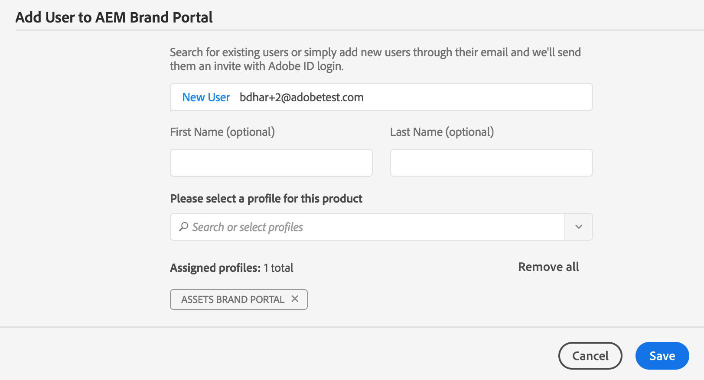

# Administrar usuarios, grupos y funciones de usuario {#manage-users-groups-and-user-roles}

Los administradores pueden utilizar Adobe Admin Console para crear usuarios y perfiles de producto de Experience Manager Assets Brand Portal y administrar sus funciones mediante la interfaz de usuario de Brand Portal. Este privilegio no está disponible para visores y editores.

En [[!UICONTROL Admin Console]](https://adminconsole.adobe.com/enterprise/overview), puedes ver todos los productos asociados con tu organización. Un producto puede ser cualquier solución de Experience Cloud, como Adobe Analytics, Adobe Target o Experience Manager Assets Brand Portal. Elija el producto de AEM Brand Portal y cree perfiles de producto.

<!--
Comment Type: draft

<note type="note">

Product profiles (formerly known as product configurations*). 

* The nomenclature has changed from product configurations to Product Profiles in the new Adobe Admin Console.

</note>
-->

Estos perfiles de producto se sincronizan con la interfaz de usuario de Brand Portal cada 8 horas y son visibles como grupos en Brand Portal. Una vez que añada usuarios y cree perfiles de producto, y después agregue usuarios a esos perfiles de producto, puede asignar funciones a usuarios y grupos en Brand Portal.

>[!NOTE]
>
>Para crear grupos en Brand Portal, desde el Adobe [!UICONTROL Admin Console], usa **[!UICONTROL Productos > Perfiles de productos]**, en lugar de **[!UICONTROL Página de usuario > Grupos de usuarios]**. Los perfiles de producto del Adobe [!UICONTROL Admin Console] se usan para crear grupos en Brand Portal.

## Agregar un usuario {#add-a-user}

Si es administrador de productos, use el Adobe [[!UICONTROL Admin Console]](https://adminconsole.adobe.com/enterprise/overview) para crear usuarios y asignarlos a perfiles de productos (*anteriormente conocidos como configuraciones de productos*), que se muestran como grupos en Brand Portal. Puede utilizar grupos para realizar operaciones masivas, como la administración de funciones y el uso compartido de recursos.

>[!NOTE]
>
>Los nuevos usuarios que no tengan acceso a Brand Portal pueden solicitar acceso desde la pantalla de inicio de sesión de Brand Portal. Para obtener más información, consulte [Solicitar acceso a Brand Portal](../using/brand-portal.md#request-access-to-brand-portal). Una vez que reciba las notificaciones de solicitud de acceso en el área de notificación, haga clic en la notificación correspondiente y luego en **[!UICONTROL Conceder acceso]**. También puede seguir el vínculo del correo electrónico de solicitud de acceso recibido. A continuación, para agregar un usuario a través del [Adobe [!UICONTROL Admin Console]](https://adminconsole.adobe.com/enterprise/overview), siga los pasos 4-7 del siguiente procedimiento.

>[!NOTE]
>
>Puede iniciar sesión en el [Adobe [!UICONTROL Admin Console]](https://adminconsole.adobe.com/enterprise/overview) directamente o desde Brand Portal. Si inicia sesión directamente, siga los pasos del 4 al 7 a continuación para agregar un usuario.

1. AEM En la barra de herramientas de la parte superior, haga clic en el logotipo del Adobe para acceder a las herramientas administrativas.

   AEM 

1. En el panel de herramientas administrativas, haga clic en **[!UICONTROL Usuarios]**.

   

1. En la página [!UICONTROL Funciones de usuario], haga clic en la ficha **[!UICONTROL Administración]** y, a continuación, haga clic en **[!UICONTROL Iniciar Admin Console]**.

   

1. En el Admin Console, realice una de las siguientes acciones para crear un nuevo usuario:

   * En la barra de herramientas de la parte superior, haz clic en **[!UICONTROL Información general]**. En la página [!UICONTROL Información general], haga clic en **[!UICONTROL Asignar usuarios]** desde la tarjeta de producto de Brand Portal.

   

   * En la barra de herramientas de la parte superior, haga clic en **[!UICONTROL Usuarios]**. En la página [!UICONTROL Usuarios], [!UICONTROL Usuarios] en el carril izquierdo están seleccionados de forma predeterminada. Haga clic en **[!UICONTROL Agregar usuario]**.

   

1. En el cuadro de diálogo Añadir usuario, escriba el ID de correo electrónico del usuario que desea agregar o seleccione el usuario de la lista de sugerencias que aparecen al escribir.

   

1. Asigne el usuario al menos a un perfil de producto (anteriormente conocido como configuraciones de producto) para que el usuario pueda acceder a Brand Portal. Seleccione el perfil de producto apropiado en el campo **[!UICONTROL Seleccione un perfil para este producto]**.
1. Haga clic en **[!UICONTROL Guardar]**. Se envía un correo electrónico de bienvenida al usuario que acaba de agregar. El usuario invitado puede hacer clic en el vínculo del correo electrónico de bienvenida para acceder a Brand Portal. El usuario puede iniciar sesión con el ID de correo electrónico ([!UICONTROL Adobe ID], [!UICONTROL Enterprise ID] o [!UICONTROL Federated ID]) configurado en el Admin Console. Para obtener más información, consulte [Experiencia del primer inicio de sesión](../using/brand-portal-onboarding.md).

   >[!NOTE]
   >
   >Si un usuario no puede iniciar sesión en Brand Portal, el administrador de la organización debe visitar el Adobe [!UICONTROL Admin Console]. Compruebe si el usuario está presente y si se ha agregado al menos a un perfil de producto.

   Para obtener información acerca de cómo conceder privilegios administrativos al usuario, vea [Proporcionar privilegios de administrador a los usuarios](../using/brand-portal-adding-users.md#provideadministratorprivilegestousers).

## Añadir un perfil de producto {#add-a-product-profile}

Los perfiles de producto (anteriormente conocidos como configuraciones de producto) en [!UICONTROL Admin Console] se utilizan para crear grupos en Brand Portal para que pueda realizar operaciones masivas como la administración de funciones y el uso compartido de recursos en Brand Portal. **Brand Portal** es el perfil de producto predeterminado disponible; puede crear más perfiles de producto y agregar usuarios a los nuevos perfiles de producto.

>[!NOTE]
>
>Puede iniciar sesión en [[!UICONTROL Admin Console]](https://adminconsole.adobe.com/enterprise/overview) directamente o desde Brand Portal. Si inicia sesión directamente en el [!UICONTROL Admin Console], siga los pasos del 4 al 7 del siguiente procedimiento para agregar un perfil de producto.

1. AEM En la barra de herramientas de la parte superior, haga clic en el logotipo del Adobe para acceder a las herramientas administrativas.

   AEM 

1. En el panel de herramientas administrativas, haga clic en **[!UICONTROL Usuarios]**.

   

1. En la página [!UICONTROL Funciones de usuario], haga clic en la ficha **[!UICONTROL Administración]** y, a continuación, haga clic en **[!UICONTROL Iniciar Admin Console]**.

   

1. En la barra de herramientas de la parte superior, haga clic en **[!UICONTROL Productos]**.
1. En la página [!UICONTROL Productos], los [!UICONTROL Perfiles de productos] están seleccionados de manera predeterminada. Haga clic en **[!UICONTROL Nuevo perfil]**.

   

1. En la página [!UICONTROL Crear un nuevo perfil], proporcione el nombre del perfil, el nombre para mostrar y la descripción del perfil. Elija que se notifique a los usuarios por correo electrónico cuando se les añada o elimine del perfil.

   

1. Haga clic en **[!UICONTROL Listo]**. El grupo de configuración del producto. Por ejemplo, el **[!UICONTROL grupo de ventas]**, se agrega a Brand Portal.

   

## Adición de usuarios a un perfil de producto {#add-users-to-a-product-profile}

Para agregar usuarios a un grupo de Brand Portal, agréguelos al perfil de producto correspondiente (anteriormente conocido como configuraciones de producto) en el [!UICONTROL Admin Console]. Puede agregar usuarios de forma individual o en lote.

>[!NOTE]
>
>Puede iniciar sesión en [[!UICONTROL Admin Console]](https://adminconsole.adobe.com/enterprise/overview) directamente o desde Brand Portal. Si inicia sesión directamente en el Admin Console, siga los pasos 4-7 del procedimiento siguiente para añadir usuarios a un perfil de producto.

1. En la barra de herramientas de la parte superior, haga clic en el logotipo del Experience Manager para acceder a las herramientas administrativas.

   AEM 

1. En el panel de herramientas administrativas, haga clic en **[!UICONTROL Usuarios]**.

   

1. En la página [!UICONTROL Funciones de usuario], haga clic en la ficha **[!UICONTROL Administración]** y, a continuación, haga clic en **[!UICONTROL Iniciar Admin Console]**.

   ![Iniciar [!DNL Admin Console]](assets/launch_admin_console.png)

1. En la barra de herramientas de la parte superior, haga clic en **[!UICONTROL Productos]**.
1. En la página [!UICONTROL Productos], los [!UICONTROL Perfiles de productos] están seleccionados de manera predeterminada. Abra el perfil de producto al que desee agregar un usuario, por ejemplo, [!UICONTROL Grupo de ventas].

   

1. Para agregar usuarios individuales al perfil de producto, haga lo siguiente:

   * Haga clic en **[!UICONTROL Agregar usuario]**.

   

   * En la página [!UICONTROL Agregar usuario al grupo de ventas], escriba el ID de correo electrónico del usuario que desea agregar o seleccione el usuario en la lista de sugerencias que aparecerán mientras escribe.

   

   * Haga clic en **[!UICONTROL Guardar]**.

1. Para añadir usuarios en bloque al perfil de producto, haga lo siguiente:

   * Elija **[!UICONTROL puntos suspensivos (...) > Agregar usuarios mediante CSV]**.

   

   * En la página **[!UICONTROL Agregar usuarios mediante CSV]**, descargue una plantilla CSV o arrastre y suelte un archivo CSV.

   

   * Haga clic en **[!UICONTROL Cargar]**. 

   Cuando añade usuarios al perfil de producto predeterminado, Brand Portal, el sistema envía un correo electrónico de bienvenida a sus ID de correo electrónico. Los usuarios invitados pueden acceder a Brand Portal haciendo clic en el vínculo del correo electrónico de bienvenida e iniciando sesión con su [!UICONTROL Adobe ID]. Ver [experiencia de primer inicio de sesión](../using/brand-portal-onboarding.md).

   Los usuarios añadidos a un perfil de producto personalizado o nuevo no reciben notificaciones por correo electrónico.

## Proporcionar privilegios de administrador a los usuarios {#provide-administrator-privileges-to-users}

Puede otorgar privilegios de administrador del sistema o de producto a un usuario de Brand Portal. Sin embargo, evite asignar otros roles administrativos disponibles en el [!UICONTROL Admin Console]. Por ejemplo, administrador de perfiles de producto, administrador de grupos de usuarios y administrador de asistencia. Consulte [Funciones administrativas](https://helpx.adobe.com/enterprise/using/admin-roles.html).

>[!NOTE]
>
>Puede iniciar sesión en [[!UICONTROL Admin Console]](https://adminconsole.adobe.com/enterprise/overview) directamente o desde Brand Portal. Si inicia sesión directamente en el [!UICONTROL Admin Console], siga los pasos del 4 al 8 del siguiente procedimiento para agregar un usuario a un perfil de producto.

1. AEM En la barra de herramientas de la parte superior, haga clic en el logotipo del Adobe para acceder a las herramientas administrativas.

   

1. En el panel de herramientas administrativas, haga clic en **[!UICONTROL Usuarios]**.

   

1. En la página [!UICONTROL Funciones de usuario], haga clic en la ficha **[!UICONTROL Administración]** y, a continuación, haga clic en **[!UICONTROL Iniciar Admin Console]**.

   

1. En la barra de herramientas de la parte superior, haga clic en **[!UICONTROL Usuarios]**.
1. En la página [!UICONTROL Usuarios], en el carril izquierdo, se seleccionan [!UICONTROL Usuarios] de forma predeterminada. Haga clic en el nombre de usuario del usuario al que desea otorgar privilegios de administrador.

   

1. En la página de perfil de usuario, localice la sección **[!UICONTROL Derechos administrativos]** en la parte inferior y elija **[!UICONTROL puntos suspensivos (...) > Editar derechos de administrador]**.
   

1. En la página [!UICONTROL Editar administrador], seleccione Administrador del sistema o Administrador de productos.

   

   >[!NOTE]
   >
   >Brand Portal solo admite funciones de administrador del sistema y administrador de productos.
   >
   >Adobe recomienda evitar el uso de la función Administrador del sistema porque otorga privilegios de administrador en toda la organización para todos los productos de una organización. Por ejemplo, un administrador del sistema de una organización que incluye tres productos en la nube para marketing tiene todo el conjunto de privilegios de los tres productos. Solo un administrador del sistema puede configurar Experience Manager Assets para que los recursos se puedan publicar de Experience Manager Assets a Brand Portal. Para obtener más información, consulte [Configuración de Experience Manager Assets con Brand Portal](../using/configure-aem-assets-with-brand-portal.md).
   >
   >Por el contrario, la función Administrador de productos otorga privilegios de administrador solo a un producto específico. Si desea aplicar un control de acceso más granular dentro de Brand Portal, utilice la función Administrador de productos y seleccione el producto como Brand Portal.

   >[!NOTE]
   >
   >Brand Portal no admite privilegios de administrador de perfiles de producto (anteriormente conocido como administrador de configuración). Evite asignar derechos de administrador de perfil de producto a un usuario.

1. Revise la selección del tipo de administrador y haga clic en **[!UICONTROL Guardar]**.

   >[!NOTE]
   >
   >Para revocar los privilegios de administrador de un usuario, realice los cambios correspondientes en la página **[!UICONTROL Editar administrador]** y, a continuación, haga clic en **[!UICONTROL Guardar]**.

## Administrar funciones de usuario {#manage-user-roles}

Un administrador puede modificar las funciones de los usuarios en Brand Portal.

Además de la función Administrador, Brand Portal admite las siguientes funciones:

* [!UICONTROL Visor]: los usuarios con esta función pueden ver los archivos y carpetas que un administrador comparte con ellos. Los visualizadores también pueden buscar y descargar recursos. Sin embargo, los visualizadores no pueden compartir contenido (archivos, carpetas, [!UICONTROL colecciones]) con otros usuarios.
* [!UICONTROL Editor]: Los usuarios con este rol tienen todos los privilegios de un visor. Además, los editores pueden compartir contenido (carpetas, [!UICONTROL colecciones], vínculos) con otros usuarios.

1. AEM En la barra de herramientas de la parte superior, haga clic en el logotipo del Adobe para acceder a las herramientas administrativas.

   

1. En el panel de herramientas administrativas, haga clic en **[!UICONTROL Usuarios]**.

   

1. En la página [!UICONTROL Funciones de usuario], la ficha [!UICONTROL Usuarios] está seleccionada de forma predeterminada. Para el usuario cuya función desee cambiar, seleccione **[!UICONTROL Editor]** o **[!UICONTROL Visor]** en la lista desplegable **[!UICONTROL Función]**.

   

   Para modificar el rol de varios usuarios simultáneamente, seleccione los usuarios y elija el rol apropiado en la lista desplegable **[!UICONTROL Rol]**.

   >[!NOTE]
   >
   >La lista [!UICONTROL Rol] para usuarios administradores está deshabilitada. No puede seleccionar a estos usuarios para modificar sus funciones.

   >[!NOTE]
   >
   >La función de usuario también se deshabilita si el usuario es miembro del grupo Editor. Para revocar los privilegios de edición al usuario, elimínelo del grupo Editor o cambie la función de todo el grupo a Visor.

1. Haga clic en **[!UICONTROL Guardar]**. La función se modifica para el usuario correspondiente. Si ha seleccionado varios usuarios, los roles de todos los usuarios se modifican simultáneamente.

   >[!NOTE]
   >
   >Los cambios en los permisos de usuario se reflejan en la página **[!UICONTROL Funciones de usuario]** solo después de que los usuarios vuelvan a iniciar sesión en Brand Portal.

## Administrar roles y privilegios de grupo {#manage-group-roles-and-privileges}

Un administrador puede asociar privilegios específicos con un [grupo](../using/brand-portal-adding-users.md#main-pars-title-278567577) de usuarios en Brand Portal. La ficha **[!UICONTROL Grupos]** de la página **[!UICONTROL Funciones de usuario]** permite a los administradores:

* Asignar funciones a grupos de usuarios
* Restrinja a los grupos de usuarios a descargar representaciones originales de archivos de imagen (.jpeg, .tiff, .png, .bmp, .gif, .pjpeg, x-portable-anymap, x-portable-bitmap, x-portable-graymap, x-portable-pixmap, x-rgb, x-xbitmap, x-xpixmap, x-icon, image/photoshop, image/x-photoshop, .psd, image/vnd.adobe.photoshop) desde Brand Portal.

>[!NOTE]
>
>Para los recursos compartidos como vínculo, se aplica el permiso para acceder a las representaciones originales de los archivos de imagen en función de los permisos del usuario que comparte los recursos.

Para modificar la función y el derecho de acceso a las representaciones originales para miembros de grupo específicos, siga estos pasos:

1. En la página **[!UICONTROL Funciones de usuario]**, vaya a la pestaña **[!UICONTROL Grupos]**.
1. Seleccione los grupos cuyos roles desea cambiar.
1. Seleccione el rol correspondiente en la lista desplegable **[!UICONTROL Rol]**.

   Para permitir que los miembros del grupo tengan acceso a las representaciones originales de los archivos de imagen que descargan del portal o del vínculo compartido, mantenga seleccionada la opción **[!UICONTROL Acceso al original]** para ese grupo. Este método incluye tipos de archivo como los siguientes:

   * .jpeg
   * .tiff
   * .png
   * .bmp
   * .gif
   * .pjpeg
   * .psd
   * x-portable-anymap
   * x-portable-bitmap
   * x-portable-graymap
   * x-portable-pixmap
   * x-rgb
   * x-xbitmap
   * x-xpixmap
   * x-icon
   * image/photoshop
   * image/x-photoshop
   * image/vnd.adobe.photoshop

   De manera predeterminada, la opción **[!UICONTROL Acceso al original]** está seleccionada para todos los usuarios. Para evitar que un grupo de usuarios acceda a las representaciones originales, anule la selección de la opción correspondiente a ese grupo.

   

   >[!NOTE]
   >
   >Si se agrega un usuario a varios grupos y si uno de estos grupos tiene restricciones, estas se aplican a ese usuario.
   >
   >Además, las restricciones para acceder a las representaciones originales de los archivos de imagen no se aplican a los administradores aunque sean miembros de grupos restringidos.

1. Haga clic en **[!UICONTROL Guardar]**. La función se modifica para los grupos correspondientes.

   >[!NOTE]
   >
   >La asociación de usuario a grupo, o la pertenencia a un grupo de un usuario, se sincroniza con Brand Portal cada 8 horas. Los cambios en las funciones de usuario o grupo se aplicarán después de que se ejecute el siguiente trabajo de sincronización.
