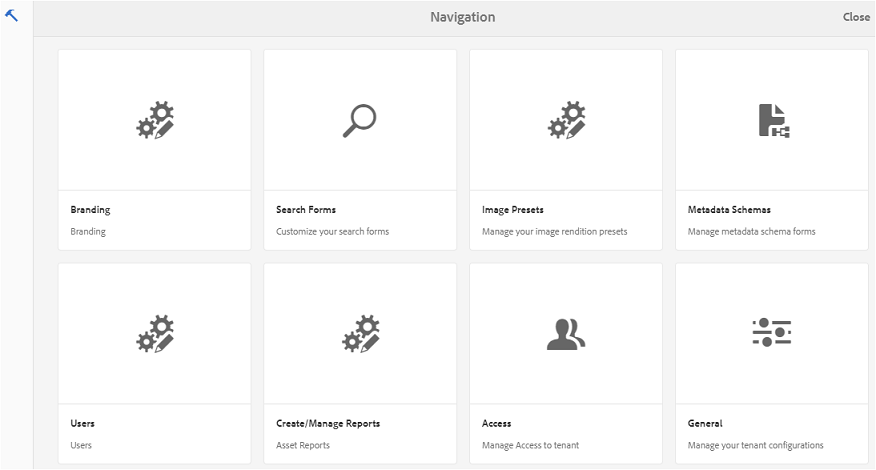
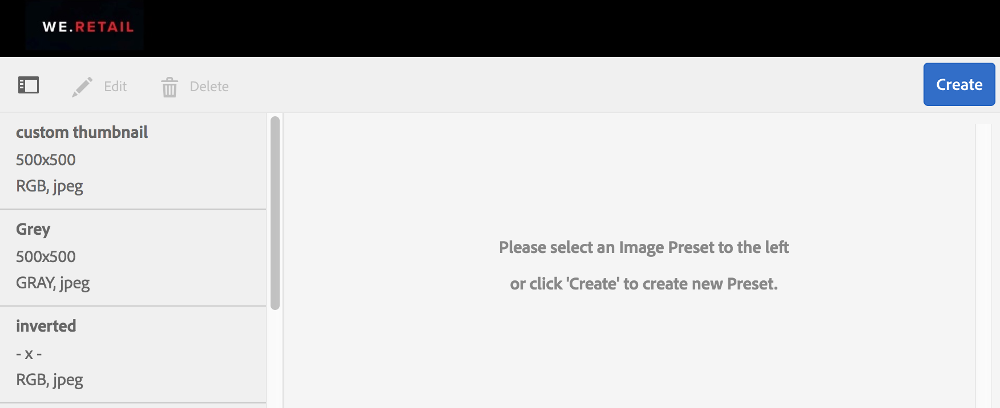
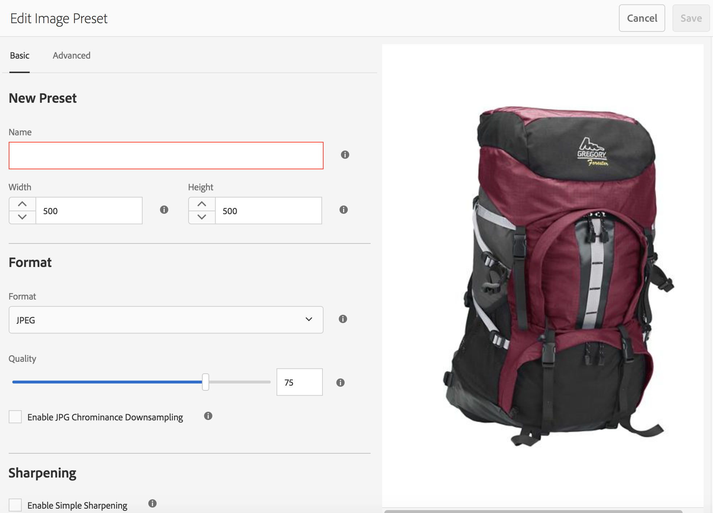
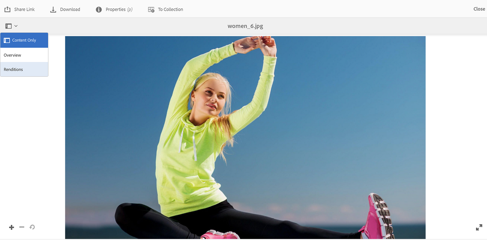
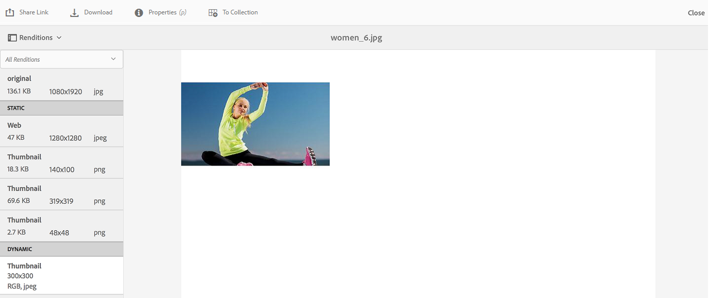
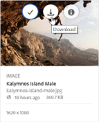
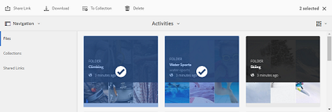
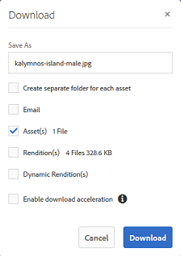
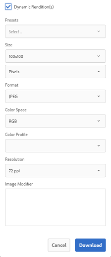

# Aplicar ajustes preestablecidos de imagen o representaciones dinámicas {#apply-image-presets-or-dynamic-renditions}

Al igual que una macro, un ajuste preestablecido de imagen es una colección predefinida de comandos de tamaño y formato guardados con un nombre. Los ajustes preestablecidos de imagen permiten a Experience Manager Assets Brand Portal ofrecer imágenes de diferentes tamaños, formatos y propiedades de forma dinámica.

Se utiliza un ajuste preestablecido de imagen para generar representaciones dinámicas de imágenes que se pueden previsualizar y descargar. Al obtener una vista previa de las imágenes y sus representaciones, puede elegir un ajuste preestablecido para cambiar el formato de las imágenes a las especificaciones establecidas por el administrador.

(*Si la instancia de autor de Experience Manager Assets se está ejecutando en **modo híbrido de Dynamic Media***). Para ver las representaciones dinámicas de un recurso en Brand Portal, asegúrese de que su representación en TIFF piramidal exista en la instancia de autor de Experience Manager Assets desde la que publica en Brand Portal. Cuando publica el recurso, su representación PTIFF también se publica en Brand Portal.

>[!NOTE]
>
>Al descargar imágenes y sus representaciones, no hay opción de elegir entre los ajustes preestablecidos existentes. En su lugar, puede especificar las propiedades de un ajuste preestablecido de imagen personalizado. Para obtener más información, consulte [Aplicar ajustes preestablecidos de imagen al descargar imágenes](../using/brand-portal-image-presets.md#main-pars-text-1403412644).

Para obtener más información sobre los parámetros necesarios al crear ajustes preestablecidos de imagen, consulte [Administrar ajustes preestablecidos de imagen](../using/brand-portal-image-presets.md).

## Crear un ajuste preestablecido de imagen {#create-an-image-preset}

Los administradores de Experience Manager Assets pueden crear ajustes preestablecidos de imagen que aparezcan como representaciones dinámicas en la página de detalles del recurso. Puede crear un ajuste preestablecido de imagen desde cero o guardar uno existente con un nombre nuevo. Al crear un ajuste preestablecido de imagen, elija un tamaño para la entrega de imágenes y los comandos de formato. Cuando una imagen se entrega para su visualización, su aspecto se optimiza según los comandos elegidos.

>[!NOTE]
>
>Las representaciones dinámicas de una imagen se crean mediante su TIFF piramidal. Si TIFF piramidal no está disponible para ningún recurso, no se podrán recuperar las representaciones dinámicas de ese recurso en Brand Portal.
>
>Si la instancia de autor de Experience Manager Assets se está ejecutando en **modo híbrido de Dynamic Media**, las representaciones de recursos de imagen de Pyramid TIFF se crean y guardan en el repositorio de Experience Manager Assets.
>
>Sin embargo, si una instancia de autor de Experience Manager Assets se está ejecutando en **Modo Scene7 de Dynamic Media**, entonces existen representaciones de recursos de imagen de TIFF piramidales en el servidor Scene7.
>
>Cuando estos recursos se publican en Brand Portal, se aplican ajustes preestablecidos de imagen y se muestran representaciones dinámicas.

1. En la barra de herramientas de la parte superior, haga clic en el logotipo de Experience Manager para acceder a las herramientas administrativas.

1. En el panel de herramientas administrativas, haga clic en **[!UICONTROL Ajustes preestablecidos de imagen]**.

   

1. En la página de ajustes preestablecidos de imagen, haga clic en **[!UICONTROL Crear]**.

   

1. En la página **[!UICONTROL Editar ajuste preestablecido de imagen]**, escriba valores en las fichas **[!UICONTROL Básico]** y **[!UICONTROL Avanzado]** según corresponda, incluido un nombre. Los ajustes preestablecidos aparecen en el panel izquierdo y se pueden utilizar sobre la marcha con otros recursos.

   

   >[!NOTE]
   >
   >También puede usar la página **[!UICONTROL Editar ajuste preestablecido de imagen]** para editar las propiedades de un ajuste preestablecido de imagen existente. Para editar un ajuste preestablecido de imagen, selecciónelo en la página Ajustes preestablecidos de imagen y haga clic en **[!UICONTROL Editar]**.

1. Haga clic en **[!UICONTROL Guardar]**. El ajuste preestablecido de imagen se crea y se muestra en la página de ajustes preestablecidos de imagen.
1. Para eliminar un ajuste preestablecido de imagen, selecciónelo en la página Ajustes preestablecidos de imagen y haga clic en **[!UICONTROL Eliminar]**. En la página de confirmación, haga clic en **[!UICONTROL Eliminar]** para confirmar la eliminación. El ajuste preestablecido de imagen se elimina de la página de ajustes preestablecidos de imagen.

## Aplicar ajustes preestablecidos de imagen al previsualizar imágenes {#apply-image-presets-when-previewing-images}

Al obtener una vista previa de las imágenes y sus representaciones, elija entre los ajustes preestablecidos existentes para cambiar el formato de las imágenes a las especificaciones establecidas por el administrador.

1. En la interfaz de Brand Portal, haga clic en una imagen para abrirla.
1. Haga clic en el icono de superposición de la izquierda y seleccione **[!UICONTROL Representaciones]**.

   

1. En la lista **[!UICONTROL Representaciones]**, seleccione la representación dinámica adecuada; por ejemplo, **[!UICONTROL Miniatura]**. La imagen de vista previa se procesará según la representación que haya elegido.

   

## Aplicar ajustes preestablecidos de imagen al descargar imágenes {#apply-image-presets-when-downloading-images}

Al descargar imágenes y sus representaciones desde Brand Portal, no puede elegir entre los ajustes preestablecidos de imagen existentes. Sin embargo, puede personalizar las propiedades del ajuste preestablecido de imagen en función de qué imágenes desee volver a dar formato.

1. Desde la interfaz de Brand Portal, realice una de las siguientes acciones:

   * Pase el puntero sobre la imagen que desee descargar. En las miniaturas de acciones rápidas disponibles, haga clic en el icono **[!UICONTROL Descargar]**.

   

   * Seleccione la imagen que desea descargar. En la barra de herramientas de la parte superior, haz clic en el icono **[!UICONTROL Descargar]**.

   

1. En el cuadro de diálogo **[!UICONTROL Descargar]**, seleccione las opciones necesarias en función de si desea descargar el recurso con o sin sus representaciones.

   

1. Para descargar representaciones dinámicas del recurso, seleccione la opción **[!UICONTROL Representaciones dinámicas]**.
1. Personalice las propiedades del ajuste preestablecido de imagen para volver a dar formato a la imagen y a sus representaciones dinámicamente durante la descarga. Especifique el tamaño, el formato, el espacio de color, la resolución y el modificador de imagen.

   

1. Haga clic en **[!UICONTROL Descargar]**. Las representaciones dinámicas personalizadas se descargan en un archivo ZIP junto con la imagen y las representaciones que eligió descargar. Sin embargo, no se crea ningún archivo zip si se descarga un solo recurso, lo que garantiza una descarga rápida.
