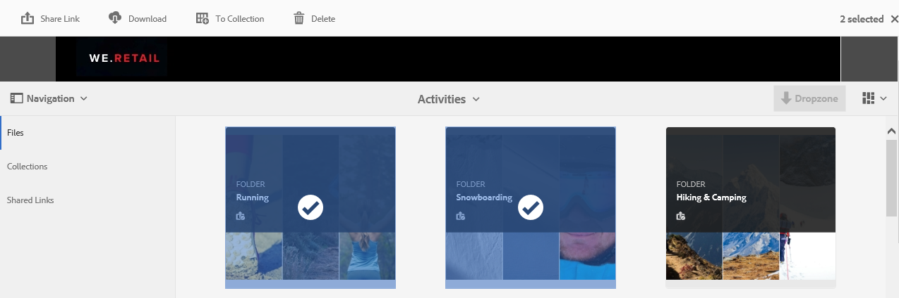
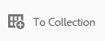
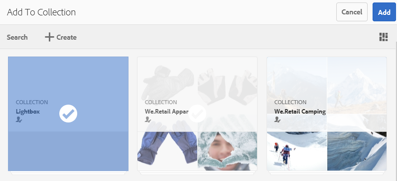
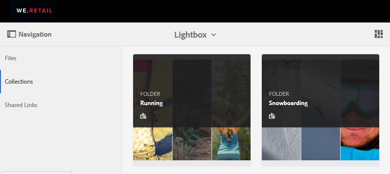
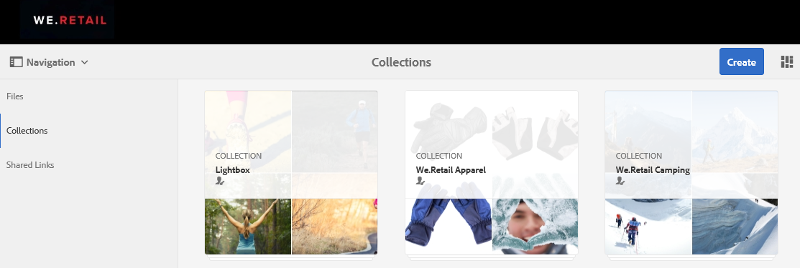
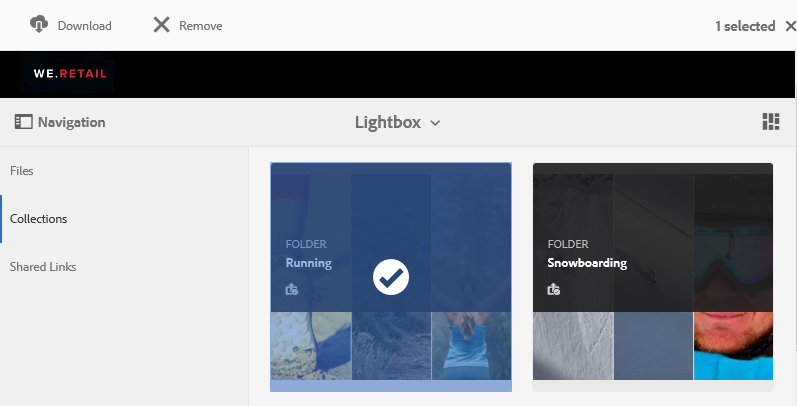

# Administración de la colección Lightbox {#manage-the-lightbox-collection}

**[!UICONTROL Lightbox]** es un tipo especial de colección que proporciona acceso fácil a los recursos. Cada usuario tiene un **[!UICONTROL Lightbox]** exclusivo que se crea automáticamente cuando inicia sesión en Brand Portal por primera vez. No se puede eliminar la colección **[!UICONTROL Lightbox]**.

## Añadir recursos a Lightbox {#add-assets-to-lightbox}

Para agregar recursos a **[!UICONTROL Lightbox]**, haga lo siguiente:

1. Vaya a la ubicación de los recursos que desea agregar a **[!UICONTROL Lightbox]** y seleccione los recursos.

   

1. En la barra de herramientas de la parte superior, haga clic en el icono **Agregar a la colección**.

   

1. En la página **[!UICONTROL Agregar a colección]**, la colección **[!UICONTROL Lightbox]** está seleccionada de forma predeterminada.

   Haga clic en **[!UICONTROL Agregar]**. Los recursos seleccionados se han agregado a **[!UICONTROL Lightbox]**.

   

1. Para revisar los recursos agregados a **[!UICONTROL Lightbox]**, haga clic en **[!UICONTROL Colecciones]** en el carril izquierdo y, a continuación, haga clic en la colección **[!UICONTROL Lightbox]**.

   

   Los recursos agregados a **[!UICONTROL Lightbox]** aparecen en la página **[!UICONTROL Lightbox]**.

   

## Eliminación de recursos de Lightbox {#remove-assets-from-lightbox}

1. Para revisar los recursos de [!UICONTROL Lightbox], haz clic en **[!UICONTROL Colecciones]** en el carril izquierdo y, a continuación, haz clic en la colección [!UICONTROL Lightbox].

   

1. Seleccione la carpeta que desee quitar de la colección y, a continuación, haga clic en **[!UICONTROL Quitar]** en la barra de herramientas de la parte superior.

   

1. En el cuadro de mensaje de advertencia, haga clic en **[!UICONTROL Quitar]** para confirmar la eliminación.

La carpeta se ha eliminado de la colección **[!UICONTROL Lightbox]**.
