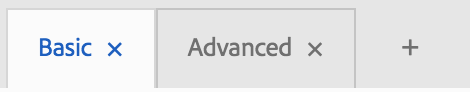
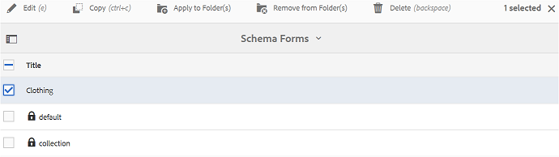

# Uso del formulario de esquema de metadatos {#use-the-metadata-schema-form}

Un esquema de metadatos describe el diseño de la página Propiedades y las propiedades de metadatos mostradas para los recursos que utilizan el esquema en particular. El esquema que aplique a un recurso determina los campos de metadatos que aparecen en su página Propiedades.

La página **[!UICONTROL Propiedades]** de cada recurso incluye propiedades de metadatos predeterminadas según el tipo MIME del recurso. Los administradores pueden utilizar el Editor de esquemas de metadatos para modificar esquemas existentes o agregar esquemas de metadatos personalizados. Experience Manager Assets Brand Portal proporciona formularios predeterminados para recursos de varios tipos MIME. Sin embargo, también puede agregar formularios personalizados para estos recursos.

## Agregar un formulario de esquema de metadatos {#add-a-metadata-schema-form}

Para crear un nuevo formulario de esquema de metadatos, haga lo siguiente:

1. En la barra de herramientas de la parte superior, haga clic en el logotipo del Experience Manager para acceder a las herramientas administrativas.

   

1. En el panel de herramientas administrativas, haga clic en **[!UICONTROL Esquemas de metadatos]**.

   

1. En la página **[!UICONTROL Forms de esquema de metadatos]**, haga clic en **[!UICONTROL Crear]**.

   

1. En el cuadro de diálogo **[!UICONTROL Crear formulario de esquema]**, especifique el título del formulario de esquema y, a continuación, haga clic en **[!UICONTROL Crear]** para completar el proceso de creación del formulario.

   

## Edición de un formulario de esquema de metadatos {#edit-a-metadata-schema-form}

Se puede editar cualquier formulario de esquema de metadatos agregado o existente. El formulario de esquema de metadatos contiene contenido derivado de su elemento principal, incluidas pestañas y elementos de formulario dentro de pestañas. Puede asignar o configurar estos elementos de formulario a un campo dentro de un nodo de metadatos.

Puede agregar nuevas pestañas o elementos de formulario al formulario de esquema de metadatos. Las pestañas derivadas y los elementos de formulario (del elemento principal) están en estado bloqueado. No se pueden modificar en el nivel secundario.

Para editar un formulario de esquema de metadatos, haga lo siguiente:

1. En la barra de herramientas de la parte superior, haga clic en el logotipo del Experience Manager para acceder a las herramientas administrativas.

   

1. En el panel de herramientas administrativas, haga clic en **[!UICONTROL Esquemas de metadatos]**.
1. En la página **[!UICONTROL Forms de esquema de metadatos]**, seleccione un formulario de esquema para editar sus propiedades; por ejemplo, **[!UICONTROL colección]**.

   

   >[!NOTE]
   >
   >Las plantillas no editadas muestran un símbolo de bloqueo antes que ellas. Si personaliza cualquiera de las plantillas, desaparece el símbolo de bloqueo antes de la plantilla.

1. En la barra de herramientas de la parte superior, haz clic en **[!UICONTROL Editar]**.

   La página **[!UICONTROL Editor de esquemas de metadatos]** se abre con la ficha **[!UICONTROL Básico]** abierta a la izquierda. A la derecha, se abre la pestaña **[!UICONTROL Generar formulario]**.

1. En la página **[!UICONTROL Editor de esquemas de metadatos]**, personalice la página **[!UICONTROL Propiedades]** del recurso. Basta con arrastrar uno o más componentes de una lista de tipos de componentes en la ficha **[!UICONTROL Generar formulario]**. Arrástrelos a la ficha **[!UICONTROL Básico]**.

   

1. Para configurar un componente, selecciónelo y modifique sus propiedades en la ficha **[!UICONTROL Configuración]**.

### Componentes de la pestaña Generar formulario {#components-in-the-build-form-tab}

La pestaña **[!UICONTROL Generar formulario]** enumera los elementos que puede usar en el formulario de esquema. La ficha **[!UICONTROL Configuración]** proporciona los atributos de cada elemento que selecciona en la ficha **[!UICONTROL Generar formulario]**. En la tabla siguiente se enumeran los elementos de formulario disponibles en la ficha **[!UICONTROL Generar formulario]**:

| Nombre del componente | Descripción |
|---------------------|--------------------------------------------------------------------------------------------------------------------------------------------------------------------------------------------------------------------------------------------------------------------------------------------|
| **[!UICONTROL Encabezado de sección]** | Añada un encabezado de sección para una lista de componentes comunes. |
| **[!UICONTROL Texto de una sola línea]** | Agregue una propiedad de texto de una sola línea. Se almacena como una cadena. |
| **[!UICONTROL Texto con varios valores]** | Agregue una propiedad de texto de varios valores. Se almacena como una matriz de cadenas. |
| **[!UICONTROL Número]** | Añada un componente de número. |
| **[!UICONTROL Fecha]** | Añada un componente de fecha. |
| **[!UICONTROL Menú Desplegable]** | Añada una lista desplegable. |
| **[!UICONTROL Etiquetas estándar]** | Añada una etiqueta. Es posible que los administradores tengan que cambiar el valor de ruta. Por ejemplo, `/etc/tags/mac/<tenant_id>/<custom_tag_namespace>`, si publican el formulario de esquema de metadatos desde Experience Manager Assets, donde la ruta no incluye información de inquilino, por ejemplo, `/etc/tags/<custom_tag_namespace>`. |
| **[!UICONTROL Etiquetas inteligentes]** | Etiquetas detectadas automáticamente si ha adquirido y configurado el complemento Experience Manager Assets smart tags. |
| **[!UICONTROL Campo oculto]** | Agregue un campo oculto. Se envía como parámetro de POST cuando se guarda el recurso. |
| **[!UICONTROL Recurso Referido Por]** | Agregue este componente para ver una lista de los recursos a los que hace referencia el recurso. |
| **[!UICONTROL Referencia de recurso]** | Agregar para mostrar una lista de recursos que hacen referencia al recurso. |
| **[!UICONTROL Clasificación de recursos]** | Clasificación promedio de un recurso agregado desde Experience Manager Assets antes de publicarse en Brand Portal. |
| **[!UICONTROL Metadatos contextuales]** | Agregue para controlar la visualización de otras pestañas de metadatos en la página Propiedades de los recursos. |

>[!NOTE]
>
>No use **[!UICONTROL referencias del producto]**, ya que no funciona.

#### Editar el componente de metadatos {#edit-the-metadata-component}

Para editar las propiedades de un componente de metadatos en el formulario, haga clic en el componente y edite sus propiedades en la pestaña **[!UICONTROL Configuración]**.

* **[!UICONTROL Etiqueta de campo]**: nombre de la propiedad de metadatos que se muestra en la página Propiedades del recurso.

* **[!UICONTROL Asignar a la propiedad]**: el valor de esta propiedad proporciona la ruta/nombre relativa al nodo de recursos donde se guarda en el repositorio de CRX. Comienza con &quot;**./**&quot; porque indica que la ruta de acceso está bajo el nodo del recurso.

Los siguientes son los valores válidos para esta propiedad:

— `./jcr:content/metadata/dc:title`: almacena el valor en el nodo de metadatos del recurso como propiedad `dc:title`.

— `./jcr:created`: muestra la propiedad jcr en el nodo del recurso. Si ha configurado estas propiedades en propiedades de vista, Adobe recomienda marcarlas como Deshabilitar edición, ya que están protegidas. De lo contrario, se produce el error &quot;Assets no pudo modificar&quot; al guardar las propiedades del recurso.

* **[!UICONTROL Marcador de posición]**: utilice esta propiedad para proporcionar al usuario información relevante acerca de la propiedad de metadatos.
* **[!UICONTROL Requerido]**: utilice esta propiedad para marcar una propiedad de metadatos como obligatoria en la página Propiedades.
* **[!UICONTROL Deshabilitar edición]**: utilice esta propiedad para que una propiedad de metadatos no se pueda editar en la página Propiedades.
* **[!UICONTROL Mostrar campo vacío en solo lectura]**: marque esta propiedad para mostrar una propiedad de metadatos en la página Propiedades aunque no tenga valor. De forma predeterminada, cuando una propiedad de metadatos no tiene valor, no se muestra en la página Propiedades.
* **[!UICONTROL Descripción]**: utilice esta propiedad para agregar una descripción breve para el componente de metadatos.
* **[!UICONTROL Icono Eliminar]**: Haga clic en este icono para eliminar un componente del formulario de esquema.

>[!NOTE]
>
>Todos los campos de metadatos son de solo lectura en el formulario del editor de metadatos de un recurso. Dado que los metadatos del recurso deben editarse en Experience Manager Assets antes de publicar un recurso en Brand Portal.

#### Agregar o eliminar una pestaña en el formulario de esquema {#add-or-delete-a-tab-in-the-schema-form}

El formulario de esquema predeterminado incluye las fichas **[!UICONTROL Básico]** y **[!UICONTROL Avanzado]**. El editor de esquemas permite añadir o eliminar una pestaña.

* Para agregar una nueva pestaña en un formulario de esquema, haga clic en **[!UICONTROL +]**. De forma predeterminada, la nueva pestaña tiene el nombre &quot;Unnamed-1&quot;. Puede modificar el nombre desde la ficha **[!UICONTROL Configuración]**.

* Para eliminar una ficha, haga clic en **[!UICONTROL x]**. Haga clic en **[!UICONTROL Guardar]** para guardar los cambios.

## Aplicar un esquema de metadatos a una carpeta {#apply-a-metadata-schema-to-a-folder}

Brand Portal permite personalizar y controlar el esquema de metadatos para que la página **[!UICONTROL Propiedades]** de un recurso muestre únicamente la información específica que elija mostrar. Para controlar los metadatos mostrados en la página **[!UICONTROL Propiedades]**, quite los metadatos requeridos del formulario de esquema de metadatos y aplíquelo a la carpeta específica.

Para aplicar un formulario de esquema de metadatos a una carpeta, haga lo siguiente:

1. En la barra de herramientas de la parte superior, haga clic en el logotipo del Experience Manager para acceder a las herramientas administrativas.

   

1. En el panel de herramientas administrativas, haga clic en **[!UICONTROL Esquemas de metadatos]**.

1. En la página **[!UICONTROL Forms de esquema de metadatos]**, seleccione el formulario de esquema que desee aplicar a un recurso, por ejemplo, **[!UICONTROL dress]**.

   

1. En la barra de herramientas de la parte superior, haga clic en **[!UICONTROL Aplicar a las carpetas]**.

1. Desde la página **[!UICONTROL Seleccionar carpetas]**, vaya a la carpeta a la que desee aplicar el esquema de metadatos **[!UICONTROL dress]**; por ejemplo, **[!UICONTROL Gloves]**.

   

1. Haga clic en **[!UICONTROL Aplicar]** para aplicar el formulario de esquema de metadatos a la carpeta.

   Los metadatos disponibles en el formulario de esquema de metadatos **[!UICONTROL wear]** se aplican a la carpeta **[!UICONTROL Gloves]** y están visibles en la página **[!UICONTROL Properties]** de la carpeta.

   

>[!NOTE]
>
>Si aplica un esquema que incluye esquemas anidados a una carpeta que contiene archivos de vídeo, es posible que las propiedades de metadatos de los archivos de vídeo no se representen correctamente. Para garantizar que las propiedades de metadatos se representen correctamente, elimine los esquemas anidados y aplique solo el esquema principal a la carpeta.

## Eliminar un formulario de esquema de metadatos {#delete-a-metadata-schema-form}

Brand Portal solo permite eliminar formularios de esquema personalizados. No permite eliminar los formularios o las plantillas de esquema predeterminados. Sin embargo, puede eliminar cualquier cambio personalizado en estos formularios.

Para eliminar un formulario, selecciónelo y haga clic en el icono **[!UICONTROL Eliminar]**.

>[!NOTE]
>
>Después de eliminar los cambios personalizados realizados en un formulario predeterminado, el símbolo **[!UICONTROL Lock]** vuelve a aparecer antes del nombre del formulario en la interfaz del esquema de metadatos para indicar que el formulario se ha revertido a su estado predeterminado.

## Formularios de esquema para TIPOS MIME {#schema-forms-for-mime-types}

### Adición de nuevos formularios para tipos MIME {#adding-new-forms-for-mime-types}

Además de los formularios predeterminados, puede agregar formularios personalizados para recursos de varios tipos MIME o crear un nuevo formulario en un tipo de formulario adecuado. Por ejemplo, para agregar una nueva plantilla para el subtipo **[!UICONTROL imagen/png]**, cree el formulario en los formularios de “imagen”. El título del formulario de esquema es el nombre del subtipo. En este caso, el título es &quot;png&quot;.

#### Uso de una plantilla de esquema existente para varios tipos MIME {#using-an-existing-schema-template-for-various-mime-types}

Puede utilizar una plantilla existente para un tipo MIME diferente. Por ejemplo, use el formulario **image/jpeg** para los recursos de tipo MIME **image/png**.

En este caso, cree un nuevo nodo en [!UICONTROL `/etc/dam/metadataeditor/mimetypemappings`] en el repositorio de CRX. Especifique un nombre para el nodo y defina las siguientes propiedades:

| **Nombre** | **Tipo** | **Valor** |
|---|---|---|
| exponsedmimetype | Cadena | image/jpeg |
| tipos MIME | Cadena [] | image/png |

* **exponsedmimetype**: nombre del formulario existente que se va a asignar
* **tipos MIME**: lista de tipos MIME que utilizan el formulario definido en el atributo **exponsedmimetype**

Brand Portal asigna los siguientes tipos MIME y formularios de esquema:

| **Formulario de esquema** | **tipos MIME** |
|---|---|
| image/jpeg | image/pjpeg |
| image/tiff | image/x-tiff |
| application/pdf | application/postscript |
| application/x-ImageSet | Multipart/Related; type=application/x-ImageSet |
| application/x-SpinSet | Multipart/Related; type=application/x-SpinSet |
| application/x-MixedMediaSet | Multipart/Related; type=application/x-MixedMediaSet |
| video/quicktime | video/x-quicktime |
| video/mpeg4 | video/mp4 |
| video/avi | video/avi, video/msvideo, video/x-msvideo |
| video/wmv | `video/x-ms-wmv` |
| video/flv | video/x-flv |

A continuación se muestra una lista de propiedades de metadatos predeterminadas:

* `jcr:content/metadata/cq:tags`
* `jcr:content/metadata/dc:format`
* `jcr:content/metadata/dam:status`
* `jcr:content/metadata/videoCodec`
* `jcr:content/metadata/audioCodec`
* `jcr:content/metadata/dc:title`
* `jcr:content/metadata/dc:description`
* `jcr:content/metadata/xmpMM:InstanceID`
* `jcr:content/metadata/xmpMM:DocumentID`
* `jcr:content/metadata/dam:sha1`
* `jcr:content/metadata/dam:solutionContext`
* `jcr:content/metadata/videoBitrate`
* `jcr:content/metadata/audioBitrate`
* `jcr:content/usages/usedBy`
* `jcr:content/jcr:lastModified`
* `jcr:content/metadata/prism:expirationDate`
* `jcr:content/onTime`
* `jcr:content/offTime`
* `jcr:content/metadata/dam:size`
* `jcr:content/metadata/tiff:ImageWidth`
* `jcr:content/metadata/tiff:ImageLength`
