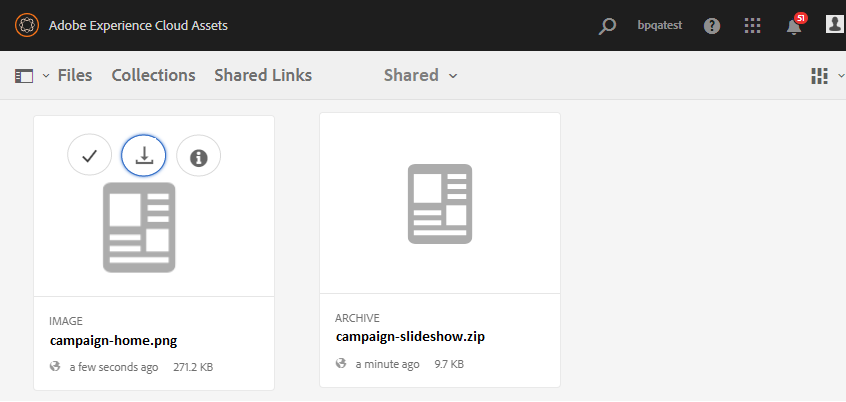
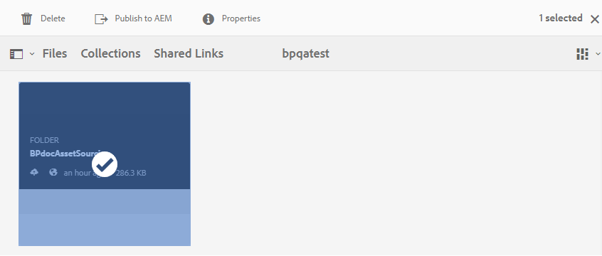
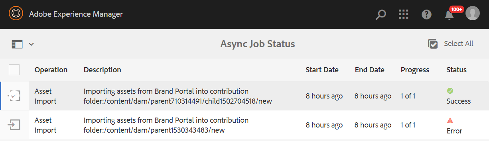

# Carpeta de contribución de Publish a Experience Manager Assets {#using-asset-souring-in-bp}

Los usuarios de Brand Portal con los permisos adecuados pueden cargar varios recursos o carpetas que contengan varios recursos en la carpeta Contribution. Sin embargo, los usuarios de Brand Portal solo pueden cargar recursos en la carpeta **NEW**. La carpeta **SHARED** está diseñada para la distribución de recursos de línea de base (contenido de referencia) que los usuarios de Brand Portal pueden usar al crear nuevos recursos para la contribución.

El usuario de Brand Portal que tiene permiso para acceder a la carpeta de contribuciones puede realizar las siguientes actividades:

* [Descargar requisitos de recursos](#download-asset-requirements)
* [Carga de nuevos recursos a la carpeta Contribution](#uplad-new-assets-to-contribution-folder)
* [Carpeta de contribución de Publish a Experience Manager Assets](#publish-contribution-folder-to-aem)

## Descargar requisitos de recursos {#download-asset-requirements}

Los usuarios de Brand Portal reciben automáticamente notificaciones por correo electrónico/pulso cada vez que el usuario de Experience Manager Assets comparte una carpeta de contribuciones, lo que les permite descargar el documento breve (requisito de recursos) y los recursos de línea de base (contenido de referencia) de la carpeta **COMPARTIDA** para asegurarse de que comprenden los requisitos de recursos.

El usuario de Brand Portal realiza las siguientes actividades para descargar los requisitos de recursos:

* **Descargar informe**: descargue el informe (documento de requisitos del recurso) adjunto a la carpeta Contribution que contiene información relacionada con el recurso, como el tipo de recursos, el propósito, los formatos admitidos, el tamaño máximo del recurso, etc.
* **Descargar recursos de línea de base**: descargue los recursos de línea de base que se pueden usar para comprender los tipos de recursos necesarios. Los usuarios de Brand Portal pueden utilizar estos recursos como referencia para crear nuevos recursos para la contribución.

El panel de Brand Portal refleja todas las carpetas existentes permitidas al usuario de Brand Portal junto con la carpeta de contribución recién compartida. En este ejemplo, el usuario de Brand Portal solo tiene acceso a la carpeta de contribución recién creada; no se comparte ninguna otra carpeta con el usuario.

**Para descargar los requisitos de recursos:**

1. Inicie sesión en la instancia de Brand Portal.
1. Seleccione la carpeta de contribución en el panel de Brand Portal.
1. Haga clic en **[!UICONTROL Propiedades]**. Se abrirá la ventana Propiedad que contiene los detalles de la carpeta Contribution.

   

   

1. Haga clic en la opción **[!UICONTROL Descargar resumen]** para descargar el documento de requisitos de recursos en el equipo local.

   

1. Vuelva al panel de Brand Portal.
1. Haga clic para abrir la carpeta Contribution. Puede ver dos subcarpetas: **[!UICONTROL COMPARTIDA]** y **[!UICONTROL NUEVA]** dentro de la carpeta Contribution. La carpeta COMPARTIDA contiene todos los recursos de línea de base (contenido de referencia) compartidos por los administradores.
1. Puede descargar la carpeta **[!UICONTROL SHARED]** que contiene todos los recursos de línea de base en su equipo local.
O bien, puede abrir la carpeta **[!UICONTROL SHARED]** y hacer clic en el icono **Descargar** para descargar archivos o carpetas individuales.

   

   

Consulte el resumen (documento de requisitos de activos) y consulte los activos de línea de base para comprender los requisitos de activos. Ahora puede crear nuevos recursos para su contribución y cargarlos en la carpeta de contribución.

## Cargar recursos a la carpeta de contribuciones {#upload-new-assets-to-contribution-folder}

Después de revisar los requisitos de los recursos, los usuarios de Brand Portal pueden crear nuevos recursos para la contribución y cargarlos en la NUEVA carpeta, dentro de la carpeta de contribución. Un usuario puede cargar varios recursos en una carpeta de contribución de recursos. Sin embargo, solo se puede crear una carpeta a la vez.

>[!NOTE]
>
>Los usuarios de Brand Portal pueden cargar recursos (un máximo de **2** GB por tamaño de archivo) en la carpeta NEW.
>
>El límite máximo de carga para cualquier inquilino de Brand Portal es de **10** GB, que se aplica de forma acumulativa a todas las carpetas de contribución.
>
>Los recursos cargados en Brand Portal no se procesan para representaciones y no contiene vistas previas.

>[!NOTE]
>
>Se recomienda liberar el espacio de carga después de publicar la carpeta de contribución en Experience Manager Assets, de modo que esté disponible para los demás usuarios de Brand Portal para contribuir.
>
>Si es necesario extender el límite de carga del inquilino de Brand Portal más allá de **10** GB, póngase en contacto con el servicio de atención al cliente especificando el requisito.

**Para cargar nuevos recursos:**

1. Inicie sesión en la instancia de Brand Portal.
El panel de Brand Portal refleja todas las carpetas existentes permitidas al usuario de Brand Portal junto con la carpeta de contribución recién compartida.

1. Seleccione la carpeta de contribución y haga clic en para abrirla. La carpeta Contribution contiene dos subcarpetas: **[!UICONTROL SHARED]** y **[!UICONTROL NEW]**.

1. Haga clic en la carpeta **[!UICONTROL NEW]**.

   

1. Haga clic en **[!UICONTROL Crear]** > **[!UICONTROL Archivos]** para cargar archivos o carpetas individuales (.zip) que contengan varios recursos.

   

1. Examine y cargue recursos (archivos o carpetas) a la carpeta **[!UICONTROL NEW]**.

   

Después de cargar todos los recursos o carpetas en la NUEVA carpeta, publique la carpeta Contribution en Experience Manager Assets.

## Carpeta de contribución de Publish a Experience Manager Assets {#publish-contribution-folder-to-aem}

Los usuarios de Brand Portal pueden publicar la carpeta Contribution en Experience Manager Assets sin necesidad de acceder a la instancia de autor de Experience Manager.

Asegúrese de haber cumplido los requisitos de los recursos y de cargar los recursos recién creados en la carpeta **NEW** dentro de la carpeta Contribution.

**Para publicar la carpeta Contribution:**

1. Inicie sesión en la instancia de Brand Portal.

1. Seleccione la carpeta de contribución en el panel de Brand Portal.
1. Haga clic en **[!UICONTROL Publish AEM para]**.

   

   

Se envía una notificación por correo electrónico/pulso al usuario y a los administradores de Brand Portal en diferentes etapas del flujo de trabajo de publicación:

1. **En cola**: se envía una notificación al usuario de Brand Portal y a los administradores de Brand Portal cuando se produce un déclencheur en un flujo de trabajo de publicación en Brand Portal.

1. **Completado**: se envía una notificación al usuario de Brand Portal y a los administradores de Brand Portal cuando la carpeta Contribution se publica correctamente en Experience Manager Assets.

Después de publicar los recursos recién creados en Experience Manager Assets, los usuarios de Brand Portal pueden eliminarlos de la nueva carpeta. Por su parte, el administrador de Brand Portal puede eliminar los recursos de las carpetas NUEVO y COMPARTIDO.

Una vez alcanzado el objetivo de crear la carpeta de contribución, el administrador de Brand Portal puede eliminarla para liberar el espacio de carga para otros usuarios.

## Estado del trabajo de publicación {#publishing-job-status}

Existen dos informes que los administradores pueden utilizar para ver el estado de las carpetas de contribución de recursos publicadas desde Brand Portal a Experience Manager Assets.

* En Brand Portal, vaya a **[!UICONTROL Herramientas]** > **[!UICONTROL Estado de contribución de recursos]**. Este informe refleja el estado de todos los trabajos de publicación en diferentes etapas del flujo de trabajo de publicación.

  

* En Experience Manager Assets (local o servicio administrado), vaya a **[!UICONTROL Assets]** > **[!UICONTROL Trabajos]**. Este informe refleja el estado final (éxito o error) de todos los trabajos de publicación.

  

* En Experience Manager Assets as a Cloud Service, vaya a **[!UICONTROL Assets]** > **[!UICONTROL Trabajos]**.

  O bien, puede navegar directamente a **[!UICONTROL Trabajos]** desde la navegación global.

  Este informe refleja el estado final (éxito o error) de todos los trabajos de publicación, incluida la importación de recursos de Brand Portal a Experience Manager Assets as a Cloud Service.

  

<!--
>[!NOTE]
>
>Currently, no report is generated in AEM Assets as a Cloud Service for the Asset Sourcing workflow. 
-->

## Eliminación automática de recursos publicados en Experience Manager Assets desde la carpeta Contribution {#automatically-delete-published-assets-from-contribution-folder}

Brand Portal AEM ahora ejecuta trabajos automáticos cada doce horas para analizar todas las carpetas de contribuciones y eliminar todos los recursos publicados en los que se ha realizado la publicación de los recursos de la. Como resultado, no es necesario eliminar manualmente los recursos de la carpeta Contribution para mantener el tamaño de la carpeta por debajo del [límite de umbral](#upload-new-assets-to-contribution-folder). También puede monitorizar el estado de los trabajos de eliminación ejecutados automáticamente durante los últimos siete días. El informe de un trabajo proporciona los siguientes detalles:

* Hora de inicio del trabajo
* Hora de finalización del trabajo
* Estado del trabajo
* Activos totales incluidos en un trabajo
* Activos totales eliminados correctamente en un trabajo
* Almacenamiento total disponible como resultado de la ejecución del trabajo

  

También puede profundizar más para ver los detalles de cada recurso incluido en un trabajo de eliminación. En el informe se incluyen detalles como el título del recurso, el tamaño, el autor, el estado de eliminación y el tiempo de eliminación.

>[!NOTE]
>
> * Los clientes pueden solicitar al Servicio de atención al cliente de Adobe que deshabilite y vuelva a habilitar la eliminación automática de trabajos o que cambie la  de su ejecución.
> * Esta función está disponible con Experience Manager 6.5.13.0 y versiones posteriores.

### Ver y descargar informes de eliminación {#view-delete-jobs}

Para ver y descargar informes de un trabajo de eliminación:

1. En Brand Portal, vaya a la opción **[!UICONTROL Herramientas]**>**[!UICONTROL Estado de contribución de recursos]**>**[!UICONTROL Informes de eliminación]**.

1. Seleccione un trabajo y haga clic en **[!UICONTROL Ver]** para ver el informe.

   Ver los detalles de cada recurso incluido en un trabajo de eliminación. En el informe se incluyen detalles como el título del recurso, el tamaño, el autor, el estado de eliminación y el tiempo de eliminación. Haga clic en **[!UICONTROL Descargar]** para descargar el informe del trabajo en formato CSV.

   El estado de eliminación de un recurso en el informe puede tener los siguientes valores posibles:

   * **Eliminado**: el recurso se eliminó correctamente de la carpeta Contribution.

   * **No encontrado** - Brand Portal no pudo encontrar el recurso en la carpeta Contribution. El recurso ya se ha eliminado manualmente de la carpeta.

   * **Omitido**: Brand Portal omitió la eliminación de recursos porque hay una nueva versión disponible para el recurso en la carpeta Contribution que aún no se ha publicado en el Experience Manager.

   * **Error**: Brand Portal no pudo eliminar el recurso. Hay tres intentos de reintento para eliminar un recurso con un estado de eliminación de `Failed`. Si el recurso no supera el tercer intento de eliminación de reintentos, debe eliminarlo manualmente.

### Eliminar un informe

Brand Portal también le permite seleccionar uno o varios informes y eliminarlos manualmente.

Para eliminar un informe, haga lo siguiente:

1. Vaya a la opción **[!UICONTROL Herramientas]**>**[!UICONTROL Estado de contribución de recursos]**>**[!UICONTROL Informes de eliminación]**.

1. Seleccione uno o varios informes y haga clic en **[!UICONTROL Eliminar]**.

