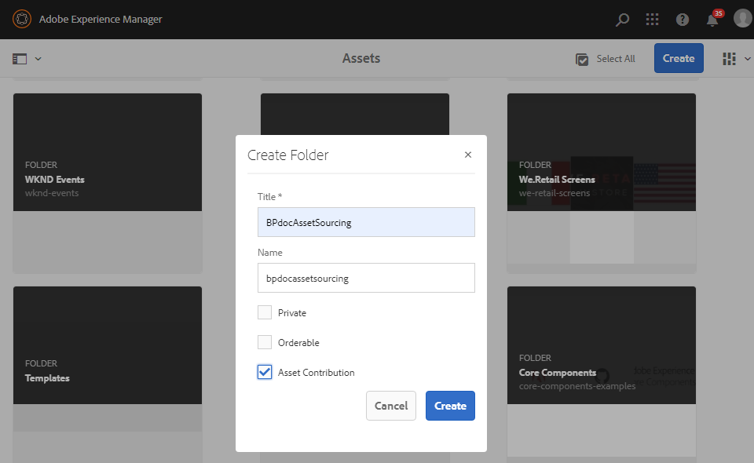
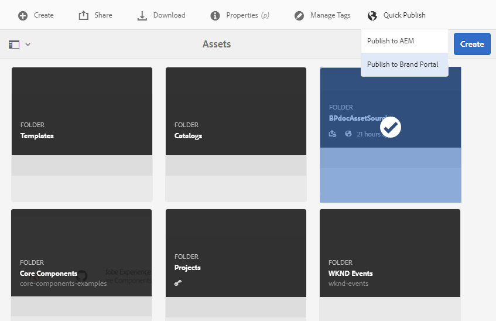

# Configuración de la carpeta Contribution en Experience Manager Assets {#configure-contribution-folder}

Para la obtención colaborativa de recursos, los usuarios de Experience Manager Assets (administradores y no administradores que tengan permiso) pueden crear nuevas carpetas de tipo **Contribución de recursos**, asegurándose de que la nueva carpeta creada esté abierta para que los usuarios de Brand Portal la envíen.  Esto almacena en déclencheur automáticamente un flujo de trabajo que crea dos subcarpetas adicionales, llamadas **SHARED** y **NEW**, dentro de la carpeta **Contribution** recién creada.

A continuación, el usuario de Experience Manager Assets define los requisitos de los recursos cargando un resumen sobre los tipos de recursos que se deben agregar a la carpeta **SHARED**, así como un conjunto de recursos de línea de base, para garantizar que los usuarios de Brand Portal tengan la información que necesitan. El administrador puede otorgar a los usuarios activos de Brand Portal acceso a la carpeta Contribution antes de publicar la carpeta Contribution recién creada en Brand Portal.

En el siguiente vídeo se muestra cómo configurar una carpeta Contribution en Experience Manager Assets:

>[!VIDEO](https://video.tv.adobe.com/v/30547)

El usuario de Experience Manager Assets realiza las siguientes actividades al configurar una carpeta de contribución:

* [Crear carpeta de contribuciones](#create-contribution-folder)
* [Cargar requisitos de recursos y asignar colaboradores](#configure-contribution-folder-properties)
* [Cargar recursos de línea base](#uplad-new-assets-to-contribution-folder)
* [Carpeta de contribución de Publish de Experience Manager Assets a Brand Portal](#publish-contribution-folder-to-brand-portal)

## Crear carpeta de contribuciones {#create-contribution-folder}

Los administradores de Experience Manager Assets y los usuarios no administradores que tengan permiso para crear una carpeta nueva pueden crear una carpeta Contribution en Experience Manager Assets.
Para crear una carpeta de contribución, cree una nueva carpeta de tipo Contribución de recursos, asegurándose de que la nueva carpeta creada esté abierta al envío de recursos por los usuarios de Brand Portal.  Esto almacena en déclencheur automáticamente un flujo de trabajo que crea dos subcarpetas adicionales, denominadas COMPARTIDO y NUEVO, dentro de la carpeta Contribution.

>[!NOTE]
>
>Los administradores pueden crear varias carpetas de contribución de recursos dentro de una carpeta.
>
>Una carpeta de contribución de recursos contiene carpetas NUEVAS y COMPARTIDAS para la distribución y contribución de los recursos. No cree ningún recurso, carpeta ni carpeta de contribución dentro de una carpeta de contribución.

Puede configurar las propiedades de la carpeta Contribution por separado y al crear la carpeta Contribution. En este ejemplo, configuramos las propiedades por separado.

**Para crear una carpeta de contribución:**

1. Inicie sesión en la instancia de Experience Manager Assets.

1. Vaya a **[!UICONTROL Assets]** > **[!UICONTROL Archivos]**. Enumera todas las carpetas existentes en el repositorio de Experience Manager Assets.

1. Haga clic en **[!UICONTROL Crear]** para crear una carpeta nueva. Se abre el cuadro de diálogo **[!UICONTROL Crear carpeta]**.

1. Escriba **[!UICONTROL Title]** y **[!UICONTROL Name]** de la carpeta y active la casilla **[!UICONTROL Contribución de recursos]**.
Se recomienda utilizar letras minúsculas sin ningún espacio para asignar un nombre a la carpeta.

1. Haga clic en **[!UICONTROL Crear]**. Puede ver la carpeta de contribución en la lista del repositorio de Experience Manager Assets.

   >[!NOTE]
   >
   >Un usuario no administrador puede crear y compartir una carpeta de contribución de recursos, pero no puede modificarla ni eliminarla.

   

1. Haga clic para abrir la carpeta Contribution. Puede ver dos subcarpetas: **[!UICONTROL COMPARTIDA]** y **[!UICONTROL NUEVA]** que se crean automáticamente en la carpeta Contribution.

   

## Configurar propiedades de la carpeta Contribution {#configure-contribution-folder-properties}

Experience Manager Assets administrator realiza las siguientes actividades mientras configura las propiedades de una carpeta de contribución.

* **Agregar descripción**: proporcione una descripción de alto nivel de la carpeta de contribución.
* **Informe de carga**: cargue el documento de requisitos de recursos que contiene información relacionada con los recursos.
* **Agregar colaboradores**: Agregue usuarios de Brand Portal para concederles acceso a la carpeta Contribution.

Los requisitos de recursos se refieren a los detalles proporcionados por los administradores para ayudar a los colaboradores (usuarios de Brand Portal) a comprender las necesidades y los requisitos de la carpeta de contribuciones. El administrador carga un documento de requisitos de recursos que contiene una breve descripción del tipo de recursos que se deben agregar a la carpeta Contribution e información relacionada con ellos, por ejemplo: propósito, tipo de imágenes, tamaño máximo, etc.

**Para configurar las propiedades de la carpeta Contribution:**

1. Inicie sesión en la instancia de Experience Manager Assets.

1. Vaya a **[!UICONTROL Assets > Archivos]** y busque la carpeta Contribution.
1. Seleccione la carpeta Contribution y haga clic en **[!UICONTROL Properties]** para abrir la ventana Folder properties.

   

   

1. Vaya a la pestaña **[!UICONTROL Contribución de recursos]**.
1. Escriba la **[!UICONTROL descripción]** de alto nivel de la carpeta de contribución.
1. Haga clic en **[!UICONTROL Cargar resumen]** para examinar desde su equipo local y cargar un **Documento de requisitos de recursos**.

   

1. En el campo **[!UICONTROL Agregar usuario]**, agregue los usuarios de Brand Portal con los que desee compartir la carpeta Contribution. Estos usuarios pueden acceder y cargar contenido en la carpeta de contribuciones mediante la interfaz de Brand Portal.
1. Haga clic en **[!UICONTROL Guardar]**.

   

>[!NOTE]
>
>Los resultados de la búsqueda se basan en la lista de usuarios de Brand Portal configurada en Experience Manager Assets. Asegúrese de tener la lista de usuarios de Brand Portal actualizada.

Los administradores pueden descargar el archivo `user.csv` de [!DNL Admin Console] y utilizarlo como plantilla base para agregar usuarios de Brand Portal. Vaya a [!UICONTROL Usuarios] y haga clic en la opción [!UICONTROL Exportar lista de usuarios a csv] para descargar el archivo `users.csv`. La siguiente lista de usuarios de ejemplo detalla los atributos necesarios para agregar a los usuarios. El único atributo obligatorio para una entrada de usuario es `Email` y los demás atributos son opcionales.

[Obtener archivo](assets/users.csv)

## Cargar recursos a la carpeta de contribuciones {#uplad-new-assets-to-contribution-folder}

El usuario de Experience Manager Assets carga un conjunto de recursos de línea de base en la carpeta **SHARED** para garantizar que los usuarios de Brand Portal tengan la información que necesitan.

**Para cargar los recursos de línea de base:**

1. Inicie sesión en la instancia de Experience Manager Assets.

1. Vaya a **[!UICONTROL Assets > Archivos]** y busque la carpeta Contribution.

1. Seleccione la carpeta de contribución y haga clic en para abrirla.

1. Haga clic en la carpeta **[!UICONTROL NEW]**.

   

1. Haga clic en **[!UICONTROL Crear]** > **[!UICONTROL Archivos]** para cargar archivos o carpetas individuales (.zip) que contengan varios recursos.

   

1. Examine y cargue recursos (archivos o carpetas) a la carpeta **[!UICONTROL NEW]**.

   

Después de cargar todos los recursos o carpetas en la NUEVA carpeta, publique la carpeta Contribution en Experience Manager Assets.

## Carpeta de contribución de Publish a Brand Portal {#publish-contribution-folder-to-brand-portal}

Una vez configurada la carpeta de contribución, el usuario de Experience Manager Assets (administrador/usuario no administrador) puede publicar la carpeta de contribución de Experience Manager Assets a Brand Portal. Los usuarios de Brand Portal que tengan permiso para acceder a la carpeta de contribuciones recibirán una notificación por correo electrónico/pulso al finalizar la acción de publicación.

**Para publicar la carpeta Contribution:**

1. Inicie sesión en la instancia de Experience Manager Assets.

1. Vaya a **[!UICONTROL Assets > Archivos]** y busque la carpeta de contribución en la que desea publicar en Brand Portal.
1. Seleccione la carpeta Contribution y haga clic en **[!UICONTROL Quick Publish]** > **[!UICONTROL Publish to Brand Portal]**.

   

   Recibirá un mensaje de éxito una vez que la carpeta de contribución se publique en Brand Portal.

Se envía una notificación por correo electrónico/pulso a los usuarios de Brand Portal asignados a la carpeta Contribution. Los usuarios de Brand Portal pueden acceder a la carpeta de contribuciones y comenzar la contribución. Consulte [Cargar recursos a la carpeta Contribution y publicarlos en Experience Manager Assets](brand-portal-publish-contribution-folder-to-aem-assets.md).
