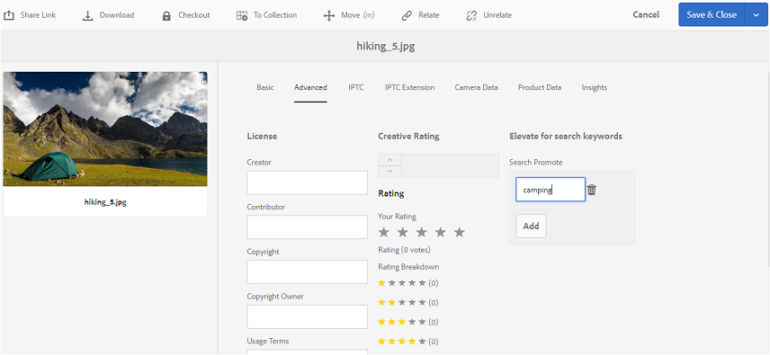

# Publicar etiquetas en Brand Portal {#publish-tags-to-brand-portal}

Obtenga información sobre cómo publicar etiquetas de Experience Manager Assets en Brand Portal.

Las etiquetas son útiles para organizar los recursos y mejorar la capacidad de búsqueda de los recursos a los que están asociados. Las etiquetas se pueden considerar palabras clave o etiquetas (metadatos) que se adjuntan a los recursos y permiten encontrarlos rápidamente como resultado de una búsqueda. Para saber cómo asignar etiquetas a los recursos en Experience Manager Assets, consulte [usar etiquetas para organizar los recursos](https://experienceleague.adobe.com/en/docs/experience-manager-65/content/assets/managing/organize-assets).

Las etiquetas (asociadas a recursos y colecciones en AEM) se publican automáticamente en Brand Portal cuando los recursos (y colecciones) con etiquetas asociadas se publican en Brand Portal. Las etiquetas publicadas son útiles para permitir que las búsquedas encuentren los recursos asociados.

>[!NOTE]
>
>Adobe recomienda publicar las etiquetas en Brand Portal exclusivamente antes de publicar los recursos (y colecciones) con los que están asociadas. Este método garantiza una publicación más rápida de los recursos (y colecciones) en Brand Portal.

## Administrar etiquetas {#manage-tags}

Puede usar las etiquetas preexistentes para adjuntarlas a un recurso o crear nuevas etiquetas desde la consola Etiquetas de AEM (**[!UICONTROL Herramientas | Etiquetado | Etiquetas AEM]**). En ambas situaciones, primero debe publicar las etiquetas en Brand Portal y, a continuación, asociarlas a los recursos adecuados.

Para crear etiquetas en AEM, publicarlas en Brand Portal y asociarlas a los recursos (o colecciones) adecuados, siga estos pasos:

1. **Crear etiquetas**
Inicie sesión en una instancia de autor de AEM con privilegios administrativos y acceda a la consola **[!UICONTROL AEM Tags]** desde la navegación global:

   1. Seleccionar **[!UICONTROL herramientas]**

   1. Seleccionar **[!UICONTROL General]**

   1. Seleccionar **[!UICONTROL Etiquetado]**

1. Seleccione **[!UICONTROL Crear]** y luego seleccione la opción **[!UICONTROL Crear etiqueta]**.
1. Especifique:

   * **[!UICONTROL Título]**
     *(obligatorio)* Un título para mostrar para la etiqueta.
   * **[!UICONTROL Nombre]**
     *(obligatorio)* Un nombre para la etiqueta. Si no se especifica, se crea un nombre de nodo válido a partir del Título. Consulte [TagID](https://experienceleague.adobe.com/en/docs/experience-manager-65/content/implementing/developing/platform/tagging/framework).
   * **Descripción**
     *(opcional)* Una descripción de la etiqueta.
   * **Ruta de etiqueta**
Ruta JCR de la etiqueta.

1. Seleccione **[!UICONTROL Enviar]** para crear la etiqueta.

   Después de crear una etiqueta en una instancia de AEM, esta estará disponible para adjuntarse a un recurso (mediante la sección Propiedades o Administrar etiquetas de ese recurso).

1. **Publicar la etiqueta en Brand Portal**.

   Vaya a la consola **[!UICONTROL Etiquetas AEM]** ([!UICONTROL Herramientas | Etiquetado | Etiquetas de AEM]), seleccione la etiqueta que desee y Publíquela en Brand Portal.

1. **Adjunte la etiqueta a un recurso (o colección)**.

   Seleccione un recurso (o una colección) y adjunte la etiqueta deseada mediante la sección Propiedades o Administrar etiquetas de ese recurso. Para obtener más información sobre cómo asignar etiquetas a los recursos de los AEM Assets, ve a [usar etiquetas para organizar los recursos](https://experienceleague.adobe.com/en/docs/experience-manager-65/content/assets/managing/organize-assets).

1. **Publicar recursos (o colecciones) en Brand Portal**.\
   Al publicar un recurso (o una colección) en Brand Portal, la etiqueta adjunta también está disponible en Brand Portal.

   Para ver la etiqueta adjunta en el recurso (o la colección) correspondiente en Brand Portal, inicie sesión en Brand Portal y, a continuación, seleccione el recurso. En la sección Propiedades, puede ver la etiqueta adjunta.

## Buscar Promocionar {#search-promote}

AEM Assets Brand Portal permite hacer que recursos específicos aparezcan como los principales resultados de las búsquedas en función de una etiqueta de palabra clave.

Para elevar un recurso para una palabra clave de búsqueda, siga estos pasos:

1. Abra la página **[!UICONTROL Propiedades]** de un recurso en la instancia de autor de AEM.
1. Vaya a la ficha **[!UICONTROL Avanzado]**.
1. En la **[!UICONTROL Promoción de búsqueda]** dentro de la sección **[!UICONTROL Elevar las palabras clave de búsqueda]**, selecciona **[!UICONTROL Agregar]** para agregar las palabras clave o etiquetas de búsqueda.

   

1. Guarde los cambios.
1. Publique el recurso en Brand Portal.
1. Inicie sesión en Brand Portal. Vea la ficha **[!UICONTROL Avanzado]** en la sección **[!UICONTROL Propiedades]** del recurso.
Tenga en cuenta que la palabra clave **[!UICONTROL Search Promote]** también está visible en las propiedades de ese recurso.
