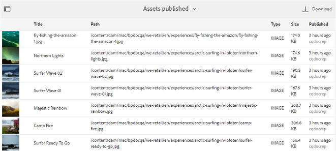

# Trabajo con informes {#work-with-reports}

La capacidad de creación de informes es fundamental para evaluar el uso de Brand Portal y conocer cómo los usuarios internos y externos interactúan con los recursos aprobados. Los administradores pueden ver el informe Uso de Brand Portal, que siempre está disponible en la página Informes de recursos. Sin embargo, los informes de inicios de sesión de usuarios y recursos descargados, caducados, publicados y compartidos a través de vínculos se pueden generar y ver desde la página Informes de recursos. Estos informes son útiles para analizar la implementación de recursos, lo que le permite derivar métricas de éxito clave para medir la adopción de recursos aprobados dentro y fuera de la organización.

La interfaz de administración de informes es intuitiva e incluye opciones y controles específicos para acceder a los informes guardados. Puede ver, descargar o eliminar informes desde la página Informes de recursos, en la que se muestran todos los informes generados anteriormente.

## Ver informes {#view-reports}

Para ver un informe, siga estos pasos:

1. En la barra de herramientas de la parte superior, haga clic en el logotipo del Experience Manager para acceder a las herramientas administrativas.

   

1. En el panel de herramientas administrativas, haga clic en **[!UICONTROL Crear/administrar informes]** para abrir la página **[!UICONTROL Informes de recursos]**.

   

1. Acceda al informe **[!UICONTROL Uso]** y a otros informes generados desde la página Informes de recursos.

   >[!NOTE]
   >
   >El informe de uso es un informe predeterminado generado en Brand Portal. No se puede crear ni eliminar. Sin embargo, puede crear, descargar y eliminar los informes Descargar, Caducidad, Publish, `Link Share` e inicios de sesión de usuarios.

   Para ver un informe, haga clic en el vínculo del informe. También puede seleccionar el informe y hacer clic en el icono Ver de la barra de herramientas.

   El **[!UICONTROL Informe de uso]** muestra información sobre la cantidad de usuarios activos de Brand Portal, el espacio de almacenamiento ocupado por todos los recursos y el recuento total de recursos en Brand Portal. Los usuarios de Brand Portal que no están asignados a ningún perfil de producto en el Admin Console se consideran usuarios inactivos y no se reflejan en el **[!UICONTROL Informe de uso]**.
El informe también muestra la capacidad permitida para cada una de estas métricas de información.

   

   El informe **[!UICONTROL Inicios de sesión de usuario]** proporciona información sobre los usuarios que iniciaron sesión en Brand Portal. El informe muestra los nombres para mostrar, los ID de correo electrónico, los perfiles (administrador, visor, editor, invitado), los grupos, el último inicio de sesión, el estado de la actividad y el recuento de inicios de sesión de cada usuario desde la implementación de Brand Portal 6.4.2 hasta el momento de la generación del informe.

   

   **[!UICONTROL Descargar]** listas de informes y detalles sobre todos los recursos descargados en un intervalo de fecha y hora específico.

   

   >[!NOTE]
   >
   >El informe de recursos **[!UICONTROL Descargar]** solo muestra los recursos seleccionados y descargados individualmente de Brand Portal. Si un usuario ha descargado una carpeta que contiene recursos, el informe no muestra la carpeta ni los recursos dentro de la carpeta.

   El informe **[!UICONTROL Caducidad]** enumera y detalla todos los recursos que caducaron en un lapso de tiempo específico.

   

   El informe **[!UICONTROL Publish]** enumera y proporciona información sobre todos los recursos publicados de Experience Manager Assets a Brand Portal en un lapso de tiempo específico.

   

   >[!NOTE]
   >
   >El informe de Publish no muestra información sobre los fragmentos de contenido, ya que estos no se pueden publicar en Brand Portal.

   El informe **[!UICONTROL Vínculos compartidos]** enumera todos los recursos compartidos a través de vínculos de la interfaz de Brand Portal en un lapso de tiempo específico. El informe detalla cuándo se compartió el recurso mediante un vínculo, qué usuario lo compartió y la fecha de caducidad del vínculo. También informa del número de vínculos compartidos para el inquilino y los usuarios. Las columnas del informe de vínculos compartidos no se pueden personalizar.

   

   >[!NOTE]
   >
   >El informe de uso compartido de vínculos no muestra los usuarios que tienen acceso al recurso compartido mediante el vínculo o que han descargado el recurso a través del vínculo.
   >
   >Para realizar el seguimiento de las descargas a través del vínculo compartido, debe generar un informe de descarga después de seleccionar la opción **[!UICONTROL Solo descargas de vínculos compartidos]** en la página **[!UICONTROL Crear informe]**. Sin embargo, el usuario (Descargado por) es anónimo en este caso.

## Generación de informes {#generate-reports}

Los administradores pueden generar y administrar los siguientes informes estándar. Después de la generación, los informes se guardan para [acceso posterior](../using/brand-portal-reports.md#main-pars-header).

* Inicios de sesión de usuario
* Descargar
* Vencimiento
* Publicación
* Vínculos compartidos

Las columnas de los informes Descarga, Caducidad y Publish se pueden personalizar para su visualización. Para generar un informe, siga estos pasos:

1. En la barra de herramientas de la parte superior, haga clic en el logotipo del Experience Manager para acceder a las herramientas administrativas.

1. En el panel de herramientas administrativas, haga clic en **[!UICONTROL Crear/administrar informes]** para abrir la página **[!UICONTROL Informes de recursos]**.

   

1. En la página Informes de recursos, haga clic en **[!UICONTROL Crear]**.
1. En la página **[!UICONTROL Crear informe]**, seleccione un informe para crear y haga clic en **[!UICONTROL Siguiente]**.

   

1. Configure los detalles del informe. Especifique el título, la descripción, la estructura de carpetas (donde el informe debe ejecutarse y generar estadísticas) y el intervalo de fechas para los informes **[!UICONTROL Descargar]**, **[!UICONTROL Caducidad]** y **[!UICONTROL Publish]**.

   

   El informe **[!UICONTROL Vínculo compartido]** solo necesita los parámetros de título, descripción e intervalo de fechas.

   

   >[!NOTE]
   >
   >Al generar el informe, se reemplazan los caracteres especiales `#` y `%` del título por un guión (-).

1. Haga clic en **[!UICONTROL Siguiente]** para configurar las columnas de los informes Descargar, Caducidad y Publish.
1. Seleccione o anule la selección de las casillas de verificación adecuadas según sea necesario. Por ejemplo, para ver los nombres de los usuarios (que descargaron los recursos) en el informe **[!UICONTROL Descargar]**, seleccione **[!UICONTROL Descargado por]**. La siguiente imagen ilustra la selección de las columnas predeterminadas en el informe de descarga.

   

   También puede agregar Columnas personalizadas a estos informes para mostrar más datos según sus necesidades personalizadas.

   Para agregar columnas personalizadas al informe Descarga, Publish o Caducidad, haga lo siguiente:

   1. Para mostrar una columna personalizada, haga clic en **[!UICONTROL Agregar]** en [!UICONTROL Columnas personalizadas].
   1. Especifique el nombre de la columna en el campo **[!UICONTROL Nombre de columna]**.
   1. Seleccione la propiedad a la que debe asignarse la columna mediante un selector de propiedades.

      
También puede escribir la ruta en el campo de ruta de la propiedad.

      

      Para agregar más columnas personalizadas, haga clic en **Agregar** y repita los pasos 2 y 3.

1. Haga clic en **[!UICONTROL Crear]**. Un mensaje notifica que se ha iniciado la generación del informe.

## Descargar informes {#download-reports}

Para guardar y descargar un informe como archivo .csv, siga uno de estos procedimientos:

* Seleccione un informe en la página Informes de recursos y haga clic en **[!UICONTROL Descargar]** en la barra de herramientas de la parte superior.

* En la página Informes de recursos, abra un informe. Seleccione la opción **[!UICONTROL Descargar]** en la parte superior de la página del informe.

## Eliminar informes {#delete-reports}

Para eliminar un informe existente, selecciónelo en la página **[!UICONTROL Informes de recursos]** y haga clic en **[!UICONTROL Eliminar]** en la barra de herramientas de la parte superior.

>[!NOTE]
>
>No se puede eliminar el informe **[!UICONTROL Uso]**.
