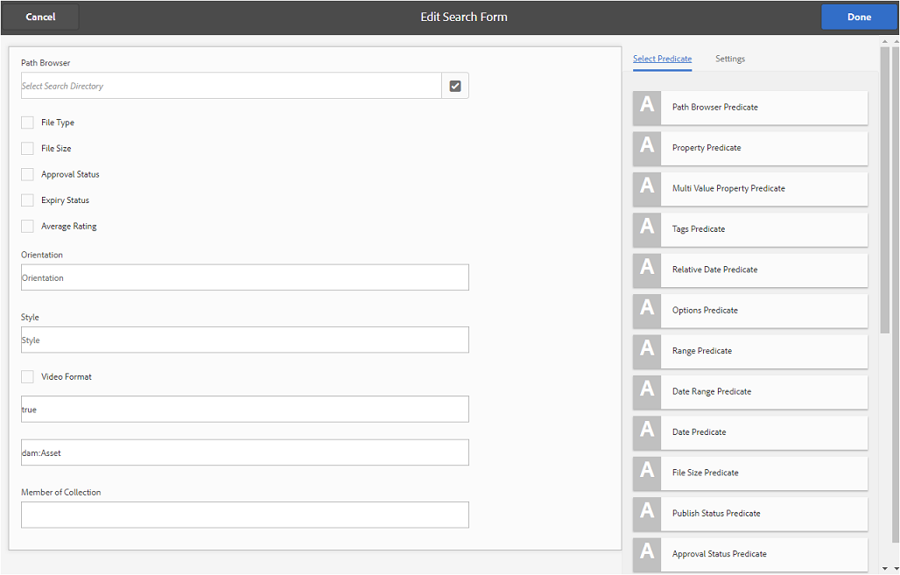

# Usar facetas de búsqueda personalizadas {#use-custom-search-facets}

Los administradores pueden agregar predicados de búsqueda al panel [!UICONTROL Filtros] para personalizar la búsqueda y hacer que la funcionalidad de búsqueda sea versátil.

Brand Portal admite [búsqueda con facetas](../using/brand-portal-searching.md#search-using-facets-in-filters-panel) para búsquedas granulares de recursos de marca aprobados, lo cual es posible debido al panel [**Filtros**](../using/brand-portal-searching.md#search-using-facets-in-filters-panel). Las facetas de búsqueda están disponibles en el panel Filtros mediante **[!UICONTROL Formulario de búsqueda]** en las herramientas de administración. Existe un formulario de búsqueda predeterminado denominado Carril de búsqueda de administración de recursos en la página Buscar Forms en las herramientas de administración. Sin embargo, los administradores pueden personalizar el panel de filtros predeterminado editando el formulario de búsqueda predeterminado (carril de búsqueda de administración de recursos) agregando, modificando o eliminando predicados de búsqueda, lo que hace que la funcionalidad de búsqueda sea versátil.

Puede utilizar varios predicados de búsqueda para personalizar el panel **[!UICONTROL Filtros]**. Por ejemplo, agregue el predicado de propiedades para buscar recursos que coincidan con una sola propiedad que especifique en este predicado. Agregue el predicado de opciones para buscar recursos que coincidan con uno o varios valores especificados para una propiedad en particular. Agregue el predicado de intervalo de fechas para buscar recursos creados dentro de un intervalo de fechas especificado.

>[!NOTE]
>
>Experience Manager Assets AEM permite que las organizaciones [publiquen los formularios de búsqueda personalizados de Autor de la](../using/publish-schema-search-facets-presets.md#publish-search-facets-to-brand-portal) en Brand Portal, en lugar de volver a crear el mismo formulario en Brand Portal.

## Añadir un predicado de búsqueda {#add-a-search-predicate}

Para agregar un predicado de búsqueda al panel **[!UICONTROL Filtros]**:

1. Para acceder a las herramientas administrativas, haga clic en el logotipo del Experience Manager en la barra de herramientas de la parte superior.

   

1. En el panel de herramientas administrativas, haga clic en **[!UICONTROL Buscar en Forms]**.

   

1. En la página **[!UICONTROL Buscar en Forms]**, seleccione **[!UICONTROL Carril de búsqueda de administración de Assets]**.

   

1. En la barra de herramientas que aparece en la parte superior, haga clic en **[!UICONTROL Editar]** para abrir el formulario de edición de búsqueda.

   

1. En la página [!UICONTROL Editar formulario de búsqueda], arrastre un predicado desde la ficha [!UICONTROL Seleccionar predicado] al panel principal. Por ejemplo, arrastre **[!UICONTROL Predicado de propiedad]**.

   El campo **[!UICONTROL Propiedad]** aparece en el panel principal y la ficha **[!UICONTROL Configuración]** de la derecha muestra los predicados de propiedades.

   

   >[!NOTE]
   >
   >La etiqueta de encabezado de la ficha **[!UICONTROL Configuración]** identifica el tipo de predicado que selecciona.

1. En la ficha **[!UICONTROL Configuración]**, escriba una etiqueta, un texto de marcador de posición y una descripción para el predicado de propiedad.

   * Seleccione **[!UICONTROL Búsqueda parcial]**, si desea permitir la búsqueda parcial de frases (y la búsqueda con comodines) de recursos basada en el valor de propiedad especificado. De forma predeterminada, el predicado admite la búsqueda de texto completo.
   * Seleccione **[!UICONTROL Ignorar mayúsculas y minúsculas]**, si desea que la búsqueda de recursos basada en el valor de la propiedad no distinga mayúsculas de minúsculas. De forma predeterminada, la búsqueda de valores de propiedad en el filtro de búsqueda distingue entre mayúsculas y minúsculas.

   >[!NOTE]
   >
   >Al seleccionar la casilla de verificación **[!UICONTROL Búsqueda parcial]**, se selecciona **[!UICONTROL Ignorar mayúsculas y minúsculas]** de forma predeterminada.

1. En el campo **[!UICONTROL Nombre de propiedad]**, abra el selector de propiedades y seleccione la propiedad en función de la cual se realiza la búsqueda. También puede introducir un nombre para la propiedad. Por ejemplo, escriba `jcr :content/metadata/dc:title` o `./jcr:content/metadata/dc:title`.

   >[!NOTE]
   >
   >En Brand Portal, todas las propiedades de cadena (excepto las que comienzan por `xmp`) de `jcrcontent/metadata` de `dam:asset` están indizadas de forma predeterminada. De forma predeterminada, el resto de propiedades personalizadas de cualquier tipo no están indizadas.
   >
   >Cualquier propiedad que esté indexada puede utilizarse al crear un predicado de propiedad. Si se configura cualquier propiedad no indizada, es posible que la consulta de búsqueda de una propiedad no indizada no proporcione ningún resultado de búsqueda.

   

1. Haga clic en **[!UICONTROL Listo]** para guardar los cambios.
1. En la interfaz de usuario de [!UICONTROL Assets], haga clic en el icono de superposición y elija **[!UICONTROL Filtro]** para ir al panel **[!UICONTROL Filtros]**. El predicado **[!UICONTROL Property]** se agrega al panel.

   

1. Escriba un título para buscar el recurso en el cuadro de texto **[!UICONTROL Propiedad]**. Por ejemplo, &quot;Adobe&quot;. Al realizar una búsqueda, los recursos cuyo título coincida con &quot;Adobe&quot; se muestran en los resultados de la búsqueda.

## Lista de predicados de búsqueda {#list-of-search-predicates}

De forma similar a como se agrega un predicado **[!UICONTROL Property]**, se pueden agregar los siguientes predicados al panel **[!UICONTROL Filtros]**:

| **Nombre de predicado** | **Descripción** | **Propiedades** |
|-------|-------|----------|
| **[!UICONTROL Navegador de rutas]** | Predicado de búsqueda para buscar recursos en una ubicación concreta. **Nota:** *Para un usuario que ha iniciado sesión, el explorador de rutas del filtro solo muestra la estructura de contenido de las carpetas (y sus antecesores) compartidas con el usuario.*   Los usuarios administradores pueden buscar recursos en cualquier carpeta navegando a ella mediante el Explorador de rutas.   Mientras que los usuarios no administradores pueden buscar recursos en una carpeta (a la que pueden acceder) navegando a esa carpeta en el Explorador de rutas. | <ul><li>Etiqueta de campo</li><li>Ruta</li><li>Descripción</li></ul> |
| **[!UICONTROL Propiedad]** | Busque recursos en función de una propiedad de metadatos determinada. **Nota:** *Al seleccionar Búsqueda parcial, se selecciona Ignorar mayúsculas y minúsculas de forma predeterminada*. | <ul><li>Etiqueta de campo</li><li>Marcador de posición</li><li>Nombre de la propiedad</li><li>Búsqueda parcial</li><li>Ignorar mayúsculas y minúsculas</li><li> Descripción</li></ul> |
| **[!UICONTROL Propiedad de varios valores]** | Similar al predicado de propiedad, pero permite varios valores de entrada, separados por un delimitador (el valor predeterminado es COMA[,]). Los recursos que coinciden con cualquiera de los valores de entrada se devuelven en los resultados. | <ul><li>Etiqueta de campo</li><li>Marcador de posición</li><li>Nombre de la propiedad</li><li>Compatibilidad con el delimitador</li><li>Ignorar mayúsculas y minúsculas</li><li>Descripción</li></ul> |
| **[!UICONTROL Etiquetas]** | Predicado de búsqueda para buscar recursos en función de etiquetas. Puede configurar la propiedad Ruta para rellenar varias etiquetas en la lista Etiquetas. AEM *Nota: Es posible que los administradores tengan que cambiar el valor de la ruta de acceso, por ejemplo, [!UICONTROL `/etc/tags/mac/<tenant_id>/<custom_tag_namespace>`], si publican el formulario de búsqueda desde la dirección de correo electrónico, donde la ruta de acceso no incluye información del inquilino, por ejemplo, [!UICONTROL `/etc/tags/<custom_tag_namespace>`]. | <ul><li>Etiqueta de campo</li><li>Nombre de la propiedad</li><li>Ruta</li><li>Descripción</li></ul> |
| **[!UICONTROL Ruta]** | Predicado de búsqueda para buscar recursos en una ubicación concreta. | <ul><li>Etiqueta de campo</li><li>Ruta</li><li>Descripción</li></ul> |                                                     |
| **[!UICONTROL Fecha relativa]** | Predicado de búsqueda para buscar recursos en función de la fecha relativa de su creación. | <ul><li>Etiqueta de campo</li><li>Nombre de la propiedad</li><li>Fecha relativa</li></ul> |
| **[!UICONTROL Intervalo]** | Predicado de búsqueda para buscar recursos que se encuentren dentro de un rango especificado de valores de propiedad. En el panel Filtros, puede especificar los valores de propiedad mínimos y máximos del rango. | <ul><li>Etiqueta de campo</li><li>Nombre de la propiedad</li><li>Descripción</li></ul> |
| **[!UICONTROL Intervalo de fecha]** | Predicado de búsqueda para buscar recursos creados dentro de un intervalo especificado para una propiedad de fecha. En el panel Filtros, puede especificar las fechas de inicio y finalización. | <ul><li>Etiqueta de campo</li><li>Marcador de posición</li><li>Nombre de la propiedad</li><li>Texto de intervalo (desde)</li><li>Texto de intervalo (hasta)</li><li>Descripción</li></ul> |
| **[!UICONTROL Fecha]** | Predicado de búsqueda para una búsqueda de recursos basada en un control deslizante y basada en una propiedad de fecha. | <ul><li>Etiqueta de campo</li><li>Nombre de la propiedad</li><li>Descripción</li></ul> |
| **[!UICONTROL Tamaño de archivo]** | Predicado de búsqueda para buscar recursos en función de su tamaño. | <ul><li>Etiqueta de campo</li><li>Nombre de la propiedad</li><li>Ruta</li><li>Descripción</li></ul> |
| **[!UICONTROL Última modificación del recurso]** | Predicado de búsqueda para buscar recursos en función de la última fecha de modificación. | <ul><li>Etiqueta de campo</li><li>Nombre de la propiedad</li><li>Descripción</li></ul> |
| **[!UICONTROL Estado de aprobación]** | Predicado de búsqueda para buscar recursos en función de la propiedad de metadatos de aprobación. El nombre de propiedad predeterminado es **dam:status**. | <ul><li>Etiqueta de campo</li><li>Nombre de la propiedad</li><li>Descripción</li></ul> |
| **[!UICONTROL Estado de cierre de compra]** | Predicado de búsqueda para buscar recursos en función del estado de cierre de compra de un recurso cuando se publicó desde AEM Assets. | <ul><li>Etiqueta de campo</li><li>Nombre de la propiedad</li><li>Descripción</li></ul> |
| **[!UICONTROL Desprotegido Por]** | Predicado de búsqueda para buscar recursos en función del usuario que ha desprotegido el recurso. | <ul><li>Etiqueta de campo</li><li>Nombre de la propiedad</li><li>Descripción</li></ul> |
| **[!UICONTROL Estado de caducidad]** | Predicado de búsqueda para buscar recursos en función del estado de caducidad. | <ul><li>Etiqueta de campo</li><li>Nombre de la propiedad</li><li>Descripción</li></ul> |
| **[!UICONTROL Miembro de la colección]** | Predicado de búsqueda para buscar recursos en función de si un recurso es parte de una colección. | Descripción |
| **[!UICONTROL Oculto]** | Este predicado no es visible explícitamente para los usuarios finales y se usa para restricciones ocultas que normalmente restringen el tipo de resultados de búsqueda a **dam:Asset**. | <ul><li>Etiqueta de campo</li><li>Nombre de la propiedad</li><li>Descripción</li></ul> |

>[!NOTE]
>
>* No use **[!UICONTROL Predicado de opciones]**, **[!UICONTROL Predicado de estado de Publish]** y **[!UICONTROL Predicado de clasificación]**, ya que estos predicados no funcionan en Brand Portal.
>* El predicado de tipo de carpeta `(nt:folder type)` no se admite en Brand Portal y puede causar problemas de rendimiento. Si está presente en el formulario de búsqueda personalizado publicado, se puede eliminar editando el formulario de búsqueda.

## Eliminar un predicado de búsqueda {#delete-a-search-predicate}

Para eliminar un predicado de búsqueda, siga estos pasos:

1. Haga clic en el logotipo del Adobe para acceder a las herramientas administrativas.

   

1. En el panel de herramientas administrativas, haga clic en **[!UICONTROL Buscar en Forms]**.

   

1. En la página **[!UICONTROL Buscar en Forms]**, seleccione **[!UICONTROL Carril de búsqueda de administración de Assets]**.

   

1. En la barra de herramientas que aparece en la parte superior, haga clic en **[!UICONTROL Editar]** para abrir el formulario de edición de búsqueda.

   

1. En la página [!UICONTROL Editar formulario de búsqueda], en el panel principal, seleccione el predicado que desee eliminar. Por ejemplo, seleccione **[!UICONTROL Predicado de propiedad]**.

   La ficha **[!UICONTROL Configuración]** de la derecha muestra los campos de predicado de propiedad.

1. Para eliminar el predicado de propiedad, haga clic en el icono bin. En el cuadro de diálogo **[!UICONTROL Eliminar campo]**, haga clic en **[!UICONTROL Eliminar]** para confirmar la acción de eliminación.

   El campo **[!UICONTROL Predicado de propiedad]** se ha eliminado del panel principal y la ficha **[!UICONTROL Configuración]** queda vacía.

   

1. Para guardar los cambios, haga clic en **[!UICONTROL Listo]** en la barra de herramientas.
1. En la interfaz de usuario de **[!UICONTROL Assets]**, haga clic en el icono de superposición y elija **[!UICONTROL Filtro]** para ir al panel **[!UICONTROL Filtros]**. El predicado **[!UICONTROL Property]** se ha eliminado del panel.

   
