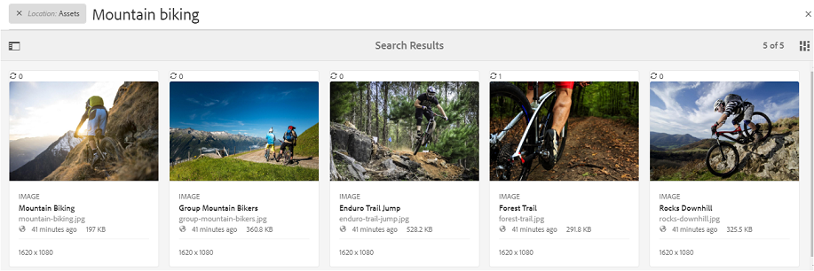
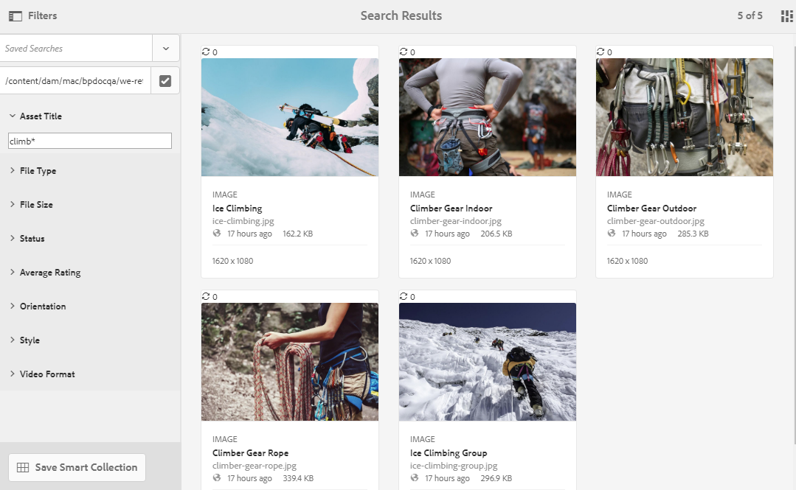

# Búsqueda de recursos en Brand Portal {#search-assets-on-brand-portal}

La capacidad de búsqueda de Brand Portal le permite buscar rápidamente recursos relevantes mediante omnisearch y la búsqueda de facetas que utiliza filtros para ayudarle a reducir aún más la búsqueda. Puede buscar recursos en el nivel de archivos o carpetas y guardar los resultados de búsqueda como colecciones inteligentes.

>[!NOTE]
>
>Brand Portal no admite la búsqueda de colecciones mediante omnisearch.
>
>Sin embargo, puede usar [filtros de búsqueda para obtener la lista de colecciones relevantes](#search-collection).

## Buscar recursos mediante Omnisearch {#search-assets-using-omnisearch}

Para buscar recursos en Brand Portal:

1. En la barra de herramientas, haga clic en el icono **[!UICONTROL Buscar]** o presione la tecla &quot;**[!UICONTROL /]**&quot; para iniciar Omnisearch.

   

1. En el cuadro de búsqueda, escriba una palabra clave para los recursos que desea buscar.

   

   >[!NOTE]
   >
   >* Se requieren al menos 3 caracteres en Omnisearch para que aparezcan las sugerencias de búsqueda.
   >* Al buscar `mountain biking`, omnisearch devuelve todos los recursos en los resultados de búsqueda que tienen `mountain` y `biking` disponibles en los campos de metadatos. Por ejemplo, `mountain` en el campo `Title` y `biking` en el campo `Description`. Ambos términos deben estar disponibles en los campos de metadatos para que se muestren en los resultados de búsqueda. Sin embargo, Omnisearch devuelve el recurso en los resultados de búsqueda aunque solo uno de los dos términos esté disponible en el campo de metadatos Etiquetas inteligentes. Por ejemplo, si un recurso contiene `mountain` como una de las etiquetas inteligentes y no contiene `biking` en ningún otro campo de metadatos y busca `mountain biking`, omnisearch sigue devolviendo el recurso en los resultados de búsqueda.

1. Seleccione entre las sugerencias relacionadas que aparecen en la lista desplegable para acceder rápidamente a los recursos relevantes.

   

   *Búsqueda de recursos mediante omnisearch*

Para obtener información acerca del comportamiento de búsqueda con recursos con etiquetas inteligentes, consulte [comprender los resultados y el comportamiento de búsqueda](https://experienceleague.adobe.com/docs/experience-manager-65/assets/using/search-assets.html?lang=es).

## Buscar mediante facetas en el panel Filtros {#search-using-facets-in-filters-panel}

Las facetas de búsqueda en el panel Filtros añaden granularidad a la experiencia de búsqueda y hacen que la funcionalidad de búsqueda sea más eficaz. Las facetas de búsqueda utilizan varias dimensiones (predicados) que le permiten realizar búsquedas complejas. Puede explorar en profundidad fácilmente el nivel de detalle deseado para lograr una búsqueda más enfocada.

Por ejemplo, si está buscando una imagen, puede elegir si desea un mapa de bits o una imagen vectorial. Puede reducir aún más el ámbito de la búsqueda especificando el tipo MIME para la imagen en la faceta de búsqueda Tipo de archivo. Del mismo modo, al buscar documentos, puede especificar el formato, por ejemplo, formato PDF o formato MS® Word.

El panel **[!UICONTROL Filtros]** incluye algunas facetas estándar, como- **[!UICONTROL Explorador de rutas]**, **[!UICONTROL Tipo de archivo]**, **[!UICONTROL Tamaño de archivo]**, **[!UICONTROL Estado]** y **[!UICONTROL Orientación]**. Sin embargo, puede [agregar facetas de búsqueda personalizadas](../using/brand-portal-search-facets.md) o quitar facetas de búsqueda específicas del panel **[!UICONTROL Filtros]** agregando o quitando predicados en el formulario de búsqueda subyacente. Vea la lista de [predicados de búsqueda disponibles y utilizables en Brand Portal](../using/brand-portal-search-facets.md#list-of-search-predicates).

Para aplicar filtros a la búsqueda, use las [facetas de búsqueda](../using/brand-portal-search-facets.md) disponibles:

1. Haga clic en el icono de superposición y seleccione **[!UICONTROL Filtro]**.

   

1. En el panel **[!UICONTROL Filtros]** de la izquierda, seleccione las opciones adecuadas para aplicar los filtros relevantes.
Por ejemplo, utilice los siguientes filtros estándar:

   * **[!UICONTROL Explorador de rutas]** para buscar recursos en un directorio específico. La ruta de búsqueda predeterminada del predicado para el explorador de rutas es `/content/dam/mac/<tenant-id>/`, que se puede configurar editando el formulario de búsqueda predeterminado.

   >[!NOTE]
   >
   >Para los usuarios que no son administradores, [!UICONTROL Explorador de rutas] en el panel [!UICONTROL Filtro] muestra solamente la estructura de contenido de las carpetas compartidas con ellos (y sus carpetas antecesoras).\
   >Para los usuarios administradores, el Navegador de rutas permite navegar a cualquier carpeta en Brand Portal.

   * **[!UICONTROL Tipo de archivo]** para especificar el tipo (imagen, documento, multimedia, archivo) de archivo de recursos que está buscando. Además, puede reducir el ámbito de la búsqueda, por ejemplo, especificar el tipo MIME (Tiff, Bitmap, GIMP Images) para la imagen o el formato (PDF o MS® Word) de los documentos.
   * **[!UICONTROL Tamaño de archivo]** para buscar recursos según su tamaño. Puede especificar los límites inferior y superior del intervalo de tamaño para restringir la búsqueda y especificar la unidad de medida que desea buscar.
   * **[!UICONTROL Estado]** para buscar recursos en función de estados de recursos, como Aprobación (aprobada, Cambios solicitados, Rechazado, Pendiente) y Caducidad.
   * **[!UICONTROL Clasificación promedio]** para buscar recursos en función de la clasificación de los recursos.
   * **[!UICONTROL Orientación]** para buscar recursos en función de la orientación (horizontal, vertical, cuadrada) de los recursos.
   * **[!UICONTROL Estilo]** para buscar recursos en función del estilo (coloreado, monocromo) de los recursos.
   * **[!UICONTROL Formato de vídeo]** para buscar recursos de vídeo según su formato (DVI, Flash, MPEG4, MPEG, OGG Theora, QuickTime, Windows Media, WebM).

   Puede usar [facetas de búsqueda personalizadas](../using/brand-portal-search-facets.md) en el panel Filtros al editar el formulario de búsqueda subyacente.

   * **[!UICONTROL Predicado de propiedad]** si se usa en el formulario de búsqueda, le permite buscar recursos que coincidan con una propiedad de metadatos a la que esté asignado el predicado.\
     Por ejemplo, si el predicado de propiedad está asignado a [!UICONTROL `jcr:content /metadata/dc:title`], puede buscar recursos en función de su título.\
     El [!UICONTROL Predicado de propiedad] admite búsquedas de texto para:

     **Frases parciales**
Para permitir la búsqueda de recursos utilizando frases parciales en el predicado de propiedad, habilite la casilla de verificación **[!UICONTROL Búsqueda parcial]** en el formulario de búsqueda. Esto le permite buscar los recursos deseados aunque no especifique las palabras o frases exactas utilizadas en los metadatos del recurso.

     >[!NOTE]
     >
     > Brand Portal admite los siguientes campos para la búsqueda parcial:
     >* jcr:content/metadata/dc:title
     >* jcr:content/jcr:title
     >* jcr:content/metadata/dam:search_promote
     >* jcr:content/metadata/dc:format

     Puede hacer lo siguiente:
      * Especifique una palabra en la frase buscada en la faceta del panel Filtros. Por ejemplo, si busca el término **climb** (y el predicado de propiedad está asignado a la propiedad [!UICONTROL `dc:title`]), se devuelven todos los recursos con la palabra **climb** en su frase de título.
      * Especifique una parte de la palabra que aparece en la frase buscada, junto con el carácter comodín (&#42;) para rellenar los huecos.
Por ejemplo, buscar:
         * **climb&#42;** devuelve todos los recursos que tienen palabras que comienzan con los caracteres &quot;climb&quot; en su frase de título.
         * **&#42;climb** devuelve todos los recursos que tienen palabras que terminan con los caracteres &quot;climb&quot; en la frase de título.
         * **&#42;climb&#42;** devuelve todos los recursos que tienen palabras que comprenden los caracteres &quot;climb&quot; en la frase de título.

     **Texto sin distinción de mayúsculas y minúsculas**
Para permitir búsquedas sin distinción de mayúsculas y minúsculas en el predicado de propiedad, habilite la casilla de verificación **[!UICONTROL Ignorar mayúsculas y minúsculas]** en el formulario de búsqueda. De forma predeterminada, la búsqueda de texto en el predicado de propiedad distingue entre mayúsculas y minúsculas.

   >[!NOTE]
   >
   >Al seleccionar la casilla de verificación **[!UICONTROL Búsqueda parcial]**, se selecciona **[!UICONTROL Ignorar mayúsculas y minúsculas]** de forma predeterminada.

   

   Los resultados de la búsqueda se muestran según los filtros aplicados, junto con el recuento de resultados de búsqueda.

   

   Resultado de la búsqueda de recursos con recuento de resultados de búsqueda.

1. Puede navegar fácilmente a un elemento desde el resultado de búsqueda y volver al mismo resultado de búsqueda utilizando el botón Atrás del explorador sin tener que volver a ejecutar la consulta de búsqueda.

## Guardar las búsquedas como colección inteligente {#save-your-searches-as-smart-collection}

Puede guardar la configuración de búsqueda como una colección inteligente para poder repetir rápidamente la misma búsqueda sin tener que rehacer la misma configuración más adelante. Sin embargo, no puede aplicar filtros de búsqueda en una colección.

Para guardar la configuración de búsqueda como una colección inteligente:

1. Pulse o haga clic en **[!UICONTROL Guardar colección inteligente]** y proporcione un nombre para la colección inteligente.

   Para que todos los usuarios tengan acceso a la colección inteligente, seleccione **[!UICONTROL Público]**. Un mensaje confirma que la colección inteligente se ha creado y agregado a la lista de búsquedas guardadas.

   >[!NOTE]
   >
   >Los usuarios no administradores pueden tener restringido el hecho de hacer públicas las colecciones inteligentes para evitar tener un gran número de colecciones inteligentes públicas creadas por usuarios no administradores en Brand Portal de la organización. Las organizaciones pueden deshabilitar la configuración **[!UICONTROL Permitir la creación de colecciones inteligentes públicas]** desde la configuración de **[!UICONTROL General]** disponible en el panel de herramientas de administración.

   

1. Para guardar la colección inteligente con un nombre diferente y activar o desactivar la casilla de verificación **[!UICONTROL Pública]**, haga clic en **[!UICONTROL Editar colección inteligente]**.

   

1. En el cuadro de diálogo **[!UICONTROL Editar colección inteligente]**, seleccione **[!UICONTROL Guardar como]** e introduzca un nombre para la colección inteligente. Haga clic en **[!UICONTROL Guardar]**.

   

## Buscar colección {#search-collection}

Omnisearch no es compatible con colecciones. Sin embargo, puede aplicar filtros de búsqueda para enumerar las colecciones relevantes desde la interfaz [!UICONTROL Collections].

En la interfaz [!UICONTROL Collections], haga clic en el icono de superposición para abrir el panel de filtro en el carril izquierdo. Aplique uno o varios filtros de búsqueda de los filtros disponibles (`modified date`, `access type` y `tags`). Enumera el conjunto de colecciones más relevante en función de los filtros aplicados.

