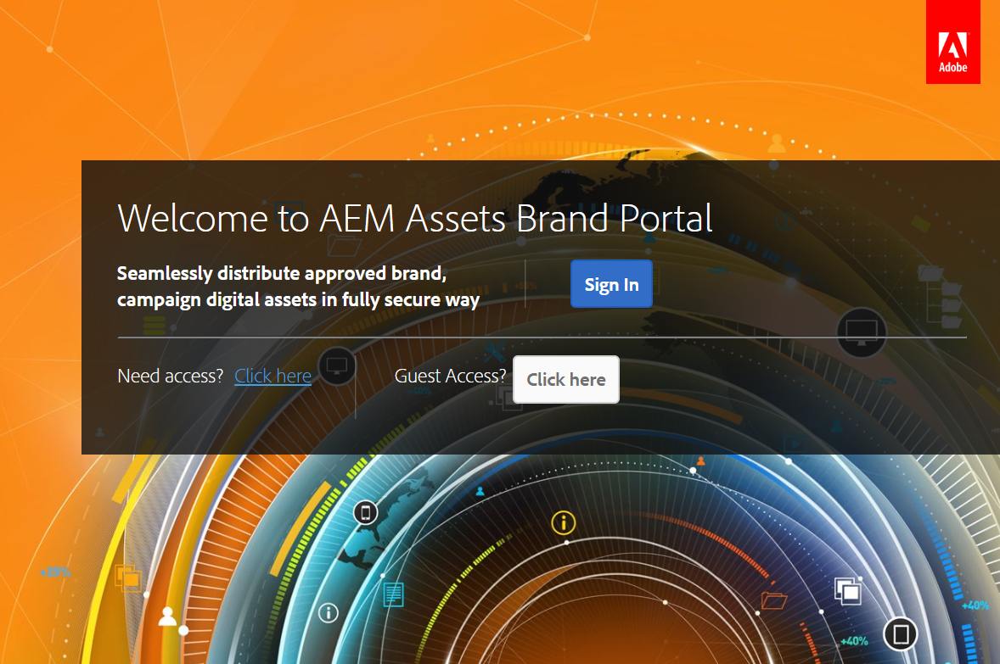
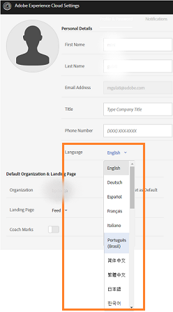
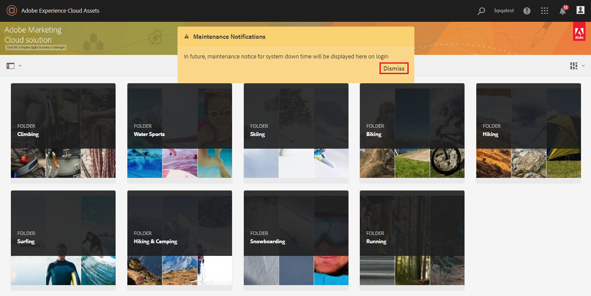

# Descripción general de Experience Manager Assets Brand Portal {#overview-of-aem-assets-brand-portal}

Como especialista en marketing, a veces necesita colaborar con socios de canal y usuarios internos de la empresa para crear, administrar y ofrecer rápidamente contenido digital relevante a los clientes. La entrega oportuna de contenido relevante en todo el recorrido del cliente es crítica para impulsar una mayor demanda, conversión, participación y lealtad del cliente.

Sin embargo, el desarrollo de soluciones que admitan el uso compartido eficiente y seguro de elementos como logotipos de marca aprobados, recursos de campañas o tomas de productos con equipos, socios y distribuidores es un desafío. Garantizar la eficiencia y la seguridad en este proceso requiere una planificación y ejecución cuidadosas.

**Adobe Experience Manager (AEM) Assets Brand Portal** se centra en la necesidad del especialista en mercadotecnia de colaborar eficazmente con los usuarios de Brand Portal distribuidos globalmente mediante la distribución de recursos y las funciones de contribución de recursos.

La distribución de recursos le permite adquirir, controlar y distribuir de forma segura recursos creativos aprobados a terceros externos y usuarios internos de la empresa entre dispositivos. Sin embargo, la contribución de recursos permite a los usuarios de Brand Portal cargar recursos en Brand Portal y publicarlos en Experience Manager Assets, sin necesidad de acceder al entorno de creación. La característica de contribución se llama **Abastecimiento de Assets en Brand Portal**. Además, mejora la experiencia general de Brand Portal en cuanto a distribución y contribución de recursos por parte de los usuarios de Brand Portal (agencias o equipos externos), acelera el tiempo de comercialización de los recursos y reduce el riesgo de incumplimiento y acceso no autorizado.
Consulte [Abastecimiento de recursos en Brand Portal](brand-portal-asset-sourcing.md).

El entorno de portal basado en explorador le permite cargar, examinar, buscar, previsualizar y exportar recursos fácilmente en formatos aprobados.

## Configurar Experience Manager Assets con Brand Portal {#configure-brand-portal}

La configuración de Adobe Experience Manager Assets con Brand Portal habilita las funciones de publicación, distribución y contribución de recursos para los usuarios de Brand Portal.

>[!NOTE]
>
>La configuración de Experience Manager Assets con Brand Portal es compatible con Experience Manager Assets as a Cloud Service, Experience Manager Assets 6.3 y versiones posteriores.

>[!IMPORTANT]
>
> * Brand Portal está en modo de mantenimiento. Todas las innovaciones de productos nuevos están disponibles en [Content Hub](https://experienceleague.adobe.com/es/docs/experience-manager-cloud-service/content/assets/content-hub/product-overview).
> * Si todavía necesita activar Brand Portal, póngase en contacto con su representante de Adobe e incluya información sobre su caso de uso y otros requisitos específicos en el mensaje.
> * Brand Portal no está disponible con [Assets Prime](https://experienceleague.adobe.com/en/docs/experience-manager-cloud-service/content/assets/assets-prime) o [Assets Ultimate](https://experienceleague.adobe.com/es/docs/experience-manager-cloud-service/content/assets/assets-ultimate-overview). Sin embargo, los clientes existentes de Assets as a Cloud Service, que ya tienen acceso a Brand Portal, pueden seguir utilizándolo cuando realicen la transición a Assets Ultimate.

<!--Experience Manager Assets as a Cloud Service is automatically configured with Brand Portal by activating Brand Portal from the Cloud Manager. The activation workflow creates the required configurations at the backend and activates Brand Portal on the same IMS org as of the Experience Manager Assets as a Cloud Service instance.-->

Sin embargo, Experience Manager Assets (local y servicio administrado) se configura manualmente con Brand Portal mediante Adobe Developer Console, que obtiene un token de Adobe Identity Management Services (IMS) para la autorización del inquilino de Brand Portal.

Para obtener más información, consulte [Configuración de Experience Manager Assets con Brand Portal](../using/configure-aem-assets-with-brand-portal.md).

## Personalidades de usuario en Brand Portal {#Personas}

Brand Portal admite las siguientes funciones de usuario:

* Usuario invitado
* Visor
* Editor
* Administrador

En la tabla siguiente se enumeran las tareas que pueden realizar los usuarios con estas funciones:

|  | **Examinar** | **Buscar** | **Descargar** | **Compartir carpetas** | **Compartir una colección** | **Compartir recursos como un vínculo** | **Acceso a las herramientas de administración** |
|--- |--- |--- |--- |--- |--- |--- |--- |
| **Usuario invitado** | ✓* | ✓* | ✓* | x | x | x | x |
| **Visor** | ✓ | ✓ | ✓ | x | x | x | x |
| **Editor** | ✓ | ✓ | ✓ | ✓ | ✓ | ✓ | x |
| **Administrador** | ✓ | ✓ | ✓ | ✓ | ✓ | ✓ | ✓ |

>[!NOTE]
>
>Los usuarios invitados solo pueden examinar, acceder y buscar recursos en carpetas públicas y colecciones.

<!--
&#42; Viewer users can access and download the public assets shared with them, and can add these assets to create their own collections.

>[!NOTE]
>
>There is a known issue that the share link for collections is currently visible to the viewer users. The viewer users does not have the privilege to add users to create a share link. This issue will be fixed in the upcoming release, the option to share link for the collections will not be available to the viewer users.
-->

### Usuario invitado {#guest-user}

Experience Manager Assets Brand Portal permite que [los invitados tengan acceso](#request-access-to-brand-portal) a Brand Portal. Un usuario invitado no necesita credenciales para entrar al portal y tiene acceso a las carpetas y colecciones públicas. Como usuario invitado, puede examinar los detalles de los recursos y tener una vista completa de los recursos de los miembros de carpetas y colecciones públicas. Puede buscar, descargar y agregar recursos públicos a la colección [!UICONTROL Lightbox].

Sin embargo, la sesión de invitado le restringe de la creación de colecciones y búsquedas guardadas, y las comparte más. Los usuarios en una sesión de invitado no pueden acceder a la configuración de carpetas y colecciones y no pueden compartir recursos como vínculo. Esta es una lista de tareas que un usuario invitado puede realizar:

* [Examen y acceso a recursos públicos](browse-assets-brand-portal.md)

* [Búsqueda de recursos públicos](brand-portal-searching.md)

* [Descarga de recursos públicos](brand-portal-download-assets.md)

* [Agregar recursos a [!UICONTROL Lightbox]](brand-portal-light-box.md#add-assets-to-lightbox)

Para obtener más información, ve a [Acceso de invitados a Brand Portal](../using/guest-access.md).

### Visor {#viewer}

Usuario de Brand Portal definido en [!DNL Admin Console] que tiene acceso a Brand Portal con el rol de Visor. Un usuario con esta función puede iniciar sesión en Brand Portal y acceder a las carpetas, colecciones y recursos permitidos. El usuario también puede examinar, previsualizar, descargar y exportar recursos (representaciones originales o específicas), configurar las opciones de la cuenta y buscar recursos. Esta es una lista de tareas que puede realizar un visor:

* [Examinar recursos](browse-assets-brand-portal.md)

* [Búsqueda de recursos](brand-portal-searching.md)

* [Descarga de recursos](brand-portal-download-assets.md)

### Editor {#editor}

Un usuario con la función de Editor puede realizar todas las tareas que puede realizar un Visor. Además, un editor puede ver los archivos y carpetas que comparte un administrador. El usuario con la función de Editor también puede compartir contenido (archivos, carpetas, colecciones) con otros.

Además de las tareas que puede realizar un visualizador, un editor puede realizar las siguientes tareas adicionales:

* [Compartir carpetas](brand-portal-sharing-folders.md)

* [Compartir una colección](brand-portal-share-collection.md)

* [Compartir recursos como un vínculo](brand-portal-link-share.md)

### Administrador {#administrator}

Un administrador incluye un usuario marcado como administrador del sistema o administrador de productos de Brand Portal en [!UICONTROL Admin Console]. Un administrador puede agregar y eliminar administradores del sistema y usuarios, definir ajustes preestablecidos, enviar correos electrónicos a los usuarios y ver informes de uso y almacenamiento del portal.

>[!NOTE]
>
>En Brand Portal, un usuario marcado con la función de administrador de soporte técnico en [!UICONTROL Admin Console] tiene los mismos privilegios que un administrador del sistema.

Un administrador puede realizar todas las tareas que puede realizar un editor. A continuación se indican las tareas adicionales que puede realizar un administrador:

* [Administrar usuarios, grupos y funciones de usuario](brand-portal-adding-users.md)
* [Personalizar papel tapiz, encabezados de página y correos electrónicos](brand-portal-branding.md)
* [Uso de facetas de búsqueda personalizadas](brand-portal-search-facets.md)
* [Usar esquema de metadatos](brand-portal-metadata-schemas.md)
* [Aplicar ajustes preestablecidos de imagen o representaciones dinámicas](brand-portal-image-presets.md)
* [Trabajar con informes](brand-portal-reports.md)

Además de las tareas anteriores, un autor de AEM Assets puede realizar las siguientes tareas:

* [Configuración de AEM Assets con Brand Portal](../using/configure-aem-assets-with-brand-portal.md)
* [Publicar carpetas en Brand Portal](https://experienceleague.adobe.com/es/docs/experience-manager-65/content/assets/brandportal/brand-portal-publish-folder)
* [Publicar colecciones en Brand Portal](https://experienceleague.adobe.com/es/docs/experience-manager-65/content/assets/brandportal/brand-portal-publish-collection)

## Alias alternativo para la URL de Brand Portal {#tenant-alias-for-portal-url}

A partir de Brand Portal 6.4.3, las organizaciones pueden tener una URL alternativa (alias) para cada URL existente de su inquilino de Brand Portal. La URL de alias se puede crear teniendo un prefijo alternativo en la URL.\
Si el nombre del inquilino tiene más de 32 caracteres, se debe crear un alias de inquilino.
Tenga en cuenta que solo se puede personalizar el prefijo de la dirección URL de Brand Portal y no la dirección URL completa. Por ejemplo, una organización con dominio existente `geomettrix.brand-portal.adobe.com` puede obtener `geomettrixinc.brand-portal.adobe.com` creado a solicitud.

Sin embargo, la instancia de autor de AEM solo se puede [configurar](../using/configure-aem-assets-with-brand-portal.md) con la URL del identificador de inquilino y no con la URL del alias de inquilino (alternativa).

>[!NOTE]
>
>Para obtener un alias para el nombre del inquilino en una URL de portal existente, las organizaciones deben ponerse en contacto con Asistencia al cliente con una nueva solicitud de creación de alias de inquilino. En primer lugar, compruebe si el alias está disponible y, a continuación, cree el alias para procesar esta solicitud.
>
>Para reemplazar el alias antiguo o eliminarlo, se debe seguir el mismo proceso.

## Solicitud de acceso a Brand Portal {#request-access-to-brand-portal}

Los usuarios pueden solicitar acceso a Brand Portal desde la pantalla de inicio de sesión. Estas solicitudes se envían a los administradores de Brand Portal, que conceden acceso a los usuarios mediante Adobe [!UICONTROL Admin Console]. Una vez concedido el acceso, los usuarios reciben un correo electrónico de notificación.

Para solicitar acceso, haga lo siguiente:

1. En la página de inicio de sesión de Brand Portal, seleccione **[!UICONTROL Haga clic aquí]** correspondiente a **[!UICONTROL Necesita acceso?]**. Sin embargo, para entrar a la sesión de invitados, seleccione **[!UICONTROL Haga clic aquí]** correspondiente a **[!UICONTROL Acceso de invitados?]**.

   

   Se abre la página [!UICONTROL Solicitar acceso].

1. Para solicitar acceso al Brand Portal de una organización, debes tener un [!UICONTROL Adobe ID], [!UICONTROL Enterprise ID] o [!UICONTROL Federated ID] válido.

   En la página [!UICONTROL Solicitar acceso], inicia sesión con tu ID (escenario 1) o crea un [!UICONTROL Adobe ID] (escenario 2):

   ![[!UICONTROL Solicitar acceso]](assets/bplogin_request_access_2.png)

   **Escenario 1**

   1. Si tienes un [!UICONTROL Adobe ID], [!UICONTROL Enterprise ID] o [!UICONTROL Federated ID], haz clic en **[!UICONTROL Iniciar sesión]**.
Se abre la página [!UICONTROL Iniciar sesión].

   1. Proporcione sus credenciales de [!UICONTROL Adobe ID] y haga clic en **[!UICONTROL Iniciar sesión]**.

      

   Se le redirigirá a la página [!UICONTROL Solicitar acceso].

   **Escenario 2**

   1. Si no tienes un [!UICONTROL Adobe ID], para crear uno, haz clic en **[!UICONTROL Obtener un Adobe ID]** de la página [!UICONTROL Solicitar acceso].
Se abre la página [!UICONTROL Iniciar sesión].
   1. Haga clic en **[!UICONTROL Obtener un Adobe ID]**.
Se abre la página [!UICONTROL Registrarse].
   1. Introduzca su nombre y apellidos, ID de correo electrónico y contraseña.
   1. Seleccione **[!UICONTROL Registrarse]**.

      

   Se le redirigirá a la página [!UICONTROL Solicitar acceso].

1. La página siguiente muestra su nombre y el ID de correo electrónico utilizado para solicitar el acceso. Deje un comentario para el administrador y haga clic en **[!UICONTROL Enviar]**.

   

## Los administradores de productos conceden acceso {#grant-access-to-brand-portal}

Los administradores de productos de Brand Portal reciben solicitudes de acceso en su área de notificaciones de Brand Portal y a través de correos electrónicos en su bandeja de entrada.

Para conceder acceso, los administradores de productos deben hacer clic en la notificación correspondiente en el área de notificación de Brand Portal y, a continuación, hacer clic en **[!UICONTROL Conceder acceso]**.
Los administradores de productos también pueden seguir el vínculo proporcionado en el correo electrónico de solicitud de acceso para visitar Adobe [!UICONTROL Admin Console] y agregar al usuario a la configuración de producto correspondiente.

Se le redirigirá a la página de inicio de [Adobe [!UICONTROL Admin Console]](https://adminconsole.adobe.com/enterprise/overview). Use Adobe [!UICONTROL Admin Console] para crear usuarios y asignarlos a perfiles de producto (anteriormente conocidos como configuraciones de producto), que se muestran como grupos en Brand Portal. Para obtener más información sobre cómo agregar usuarios en [!UICONTROL Admin Console], consulte [Agregar un usuario](brand-portal-adding-users.md#add-a-user) (siga los pasos del 4 al 7 del procedimiento para agregar un usuario).

## Idiomas de Brand Portal {#brand-portal-language}

Puede cambiar el idioma de Brand Portal desde Adobe [!UICONTROL Configuración de Experience Cloud].

Para cambiar el idioma:

1. Seleccione [!UICONTROL Usuario] > [!UICONTROL Editar perfil] en el menú superior.

   

1. En la página [!UICONTROL Configuración de Experience Cloud], seleccione un idioma en el menú desplegable [!UICONTROL Idioma].

## Notificación de mantenimiento de Brand Portal {#brand-portal-maintenance-notification}

Antes de que se programe el apagado de Brand Portal para mantenimiento, se muestra una notificación como banner después de iniciar sesión en Brand Portal. Una notificación de ejemplo:

Puede descartar esta notificación y seguir utilizando Brand Portal. Esta notificación aparece en cada nueva sesión.

## Versión e información del sistema {#release-and-system-information}

* [Novedades](whats-new.md)
* [Notas de la versión](brand-portal-release-notes.md)
* [Formatos de archivo compatibles](brand-portal-supported-formats.md)

## Recursos relacionados {#related-resources}

<!--
* [Adobe Customer Support]()
-->

* [Foros de AEM](https://experienceleaguecommunities.adobe.com/t5/adobe-experience-manager/ct-p/adobe-experience-manager-community)
