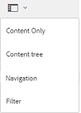

# Examen de recursos en Brand Portal {#browsing-assets-on-brand-portal}

Experience Manager Assets Brand Portal ofrece varias funciones y elementos de interfaz de usuario que facilitan la exploración de recursos, la navegación por jerarquías de recursos y la búsqueda de recursos mediante diferentes opciones de vista.

El logotipo de Experience Manager de la barra de herramientas de la parte superior facilita a los usuarios administradores el acceso al panel de herramientas administrativas.

El selector de carril en la parte superior izquierda de la lista desplegable de Brand Portal muestra las opciones para navegar por las jerarquías de recursos, optimizar la búsqueda y mostrar los recursos.

Puede ver, navegar y seleccionar recursos mediante cualquiera de las vistas disponibles (Tarjeta, Columna y Lista) en el selector de vistas de Brand Portal.

## Visualización y selección de los recursos {#viewing-and-selecting-resources}

Conceptualmente, la visualización, la navegación y la selección de cada una de ellas son iguales en todas las vistas, pero existen pequeñas variaciones en el manejo, según la vista que utilice.

Puede ver, navegar y seleccionar sus recursos (para realizar más acciones) con cualquiera de las vistas disponibles:

* Vista de columna
* Vista de tarjeta
* Vista de lista   

### Vista de tarjeta

La vista de tarjeta muestra tarjetas de información para cada elemento del nivel actual. Estas tarjetas proporcionan los siguientes detalles:

* Una representación visual del recurso o la carpeta.
* Tipo
* Título
* Nombre
* Fecha y hora en que se publicó el recurso en Brand Portal AEM desde el momento de su publicación en el
* Tamaño
* Dimensiones

Puede desplazarse hacia abajo en la jerarquía haciendo clic en las tarjetas (con cuidado de evitar las acciones rápidas) o hacia arriba de nuevo mediante las [rutas de exploración del encabezado](https://experienceleague.adobe.com/en/docs/experience-manager-65/content/sites/authoring/essentials/basic-handling).

#### Vista de tarjeta para usuarios no administradores

Las tarjetas de carpetas, en la Vista de tarjetas, muestran información de jerarquía de carpetas a usuarios no administradores (editor, visor y usuario invitado). Esta funcionalidad permite a los usuarios conocer la ubicación de las carpetas a las que acceden con respecto a la jerarquía principal.

La información de jerarquía de carpetas es especialmente útil para diferenciar las carpetas que tienen nombres similares a otras carpetas compartidas desde una jerarquía de carpetas diferente. Si los usuarios no administradores no son conscientes de la estructura de carpetas de los recursos compartidos con ellos, los recursos o carpetas con nombres similares parecen confusos.

* Las rutas mostradas en las respectivas tarjetas se truncan para ajustarse a los tamaños de tarjeta. Sin embargo, los usuarios pueden ver la ruta completa como información del objeto pasando el ratón por encima de la ruta truncada.

**Opción de información general para ver las propiedades de los recursos**

La opción Información general está disponible para los usuarios no administradores (editores, visualizadores, usuarios invitados) para ver las propiedades de recursos de los recursos o carpetas seleccionados. La opción Información general está visible:

* En la barra de herramientas, en la parte superior, al seleccionar un recurso o una carpeta.
* En la lista desplegable, seleccione el selector de carril.

Al seleccionar la opción **[!UICONTROL Información general]** mientras se selecciona un recurso o una carpeta, los usuarios pueden ver el título, la ruta y la hora de creación del recurso. Mientras que en la página de detalles del recurso, seleccionar la opción Información general permite a los usuarios ver los metadatos del recurso.

#### Configuración de vista en la vista de tarjeta

El cuadro de diálogo **[!UICONTROL Ver configuración]** se abre seleccionando **[!UICONTROL Ver configuración]** en el selector de vista. Permite cambiar el tamaño de las miniaturas de los recursos en la vista de tarjetas. De este modo, puede personalizar la vista y controlar el número de miniaturas que se muestran.

### Vista de lista   

La vista de lista muestra información para cada recurso en el nivel actual. La vista de lista proporciona los siguientes detalles:

* Imagen en miniatura de recursos
* Nombre
* Título
* Configuración regional
* Tipo
* Dimensión
* Tamaño
* Clasificación
* Ruta de carpeta que muestra la jerarquía de recursos
* Fecha de publicación del recurso en Brand Portal

La columna de ruta permite identificar fácilmente la ubicación de los recursos en la jerarquía de carpetas. Para desplazarse hacia abajo en la jerarquía, haga clic en el nombre del recurso y retroceda utilizando las [rutas de exploración del encabezado](https://experienceleague.adobe.com/en/docs/experience-manager-65/content/sites/authoring/essentials/basic-handling).

<!--
Comment Type: draft lastmodifiedby="mgulati" lastmodifieddate="2018-08-17T03:12:05.096-0400" type="annotation">Removed:- "Selecting assets in list view To select all items in the list, use the checkbox at the upper left of the list. When all items in the list are selected, this check box appears checked. To deselect all, click or tap the checkbox. When only some items are selected, it appears with a minus sign. To select all, click or tap the checkbox. To deselect all, click or tap the checkbox again. You can change the order of items using the dotted vertical bar at the far right of each item in the list. Click the vertical selection bar and drag the item to a new position in the list."
 -->

### Configuración de vista en la vista de lista

La vista de lista muestra el recurso **[!UICONTROL Name]** como la primera columna de forma predeterminada. También se muestra información adicional, como el recurso **[!UICONTROL Title]**, **[!UICONTROL Locale]**, **[!UICONTROL Type]**, **[!UICONTROL Dimension]**, **[!UICONTROL Size]**, **[!UICONTROL Rating]** y el estado de publicación. Sin embargo, puede seleccionar las columnas que se mostrarán con **[!UICONTROL Ver configuración]**.

### Vista de columna

Utilice la vista de columna para desplazarse por un árbol de contenido a través de una serie de columnas en cascada. Esta vista le ayuda a visualizar y atravesar la jerarquía de recursos.

Al seleccionar un recurso en la primera columna (situada más a la izquierda), se muestran los recursos secundarios en la segunda columna situada a la derecha. Al seleccionar un recurso en la segunda columna, se muestran los recursos secundarios en la tercera columna a la derecha, etc.

Puede navegar hacia arriba y hacia abajo en el árbol. Haga clic en el nombre del recurso o en las comillas angulares a la derecha del nombre del recurso.

* El nombre del recurso y las comillas angulares se resaltan al pulsar o hacer clic en él.
* Al tocar o hacer clic en la miniatura, se selecciona el recurso.
* Al seleccionarlo, se superpone una marca de verificación en la miniatura y se resalta el nombre del recurso.
* Los detalles del recurso seleccionado se mostrarán en la última columna.

Cuando se selecciona un recurso en la vista de columna, se muestra una representación visual del recurso en la columna final junto con los siguientes detalles:

* Título
* Nombre
* Dimensiones
* Fecha y hora en que se publicó el recurso en Brand Portal AEM desde el momento de su publicación en el
* Tamaño
* Tipo
* Opción Más detalles que va con la página de detalles del recurso

<!--
Comment Type: draft

<h3>Selecting Resources</h3>
-->

<!--
Comment Type: draft

Selecting a specific resource depends on a combination of the view and the device:

-->

<!--
Comment Type: draft

<table border="1" cellpadding="1" cellspacing="0" width="100%">
<tbody>
<tr>
<td> </td>
<td>Select</td>
<td>Deselect</td>
</tr>
<tr>
<td>Column View  </td>
<td>
<ul>
<li>Desktop:  Mouseover, then use the check mark quick action</li>
<li>Mobile device:  Tap the thumbnail</li>
</ul> </td>
<td>
<ul>
<li>Desktop:  Click the thumbnail</li>
<li>Mobile device:  Tap the thumbnail</li>
</ul> </td>
</tr>
<tr>
<td>Card View  </td>
<td>
<ul>
<li>Desktop:  Mouseover, then use the check mark quick action</li>
<li>Mobile device:  Tap-and-hold the card</li>
</ul> </td>
<td>
<ul>
<li>Desktop:  Click the card</li>
<li>Mobile device:  Tap the card</li>
</ul> </td>
</tr>
<tr>
<td>List View</td>
<td>
<ul>
<li>Desktop:  Mouseover, then use the check mark quick action</li>
<li>Mobile device:  Tap the thumbnail</li>
</ul> </td>
<td>
<ul>
<li>Desktop:  Click the thumbnail</li>
<li>Mobile device:  Tap the thumbnail</li>
</ul> </td>
</tr>
</tbody>
</table>
-->

<!--
Comment Type: draft

Deselecting All
-->

<!--
Comment Type: draft

In all cases, as you select items the count of the items selected is displayed at the upper right of the toolbar.

You can deselect all items and exit selection mode by clicking or tapping the X next to the count.

-->

<!--
Comment Type: draft

In all views, all items can be deselected by tapping escape on the keyboard if you are using a desktop device.

-->

## Árbol de contenido {#content-tree}

Además de estas vistas, utilice la vista de árbol para explorar en profundidad la jerarquía de recursos mientras ve y selecciona los recursos o carpetas que desee.

Para abrir la vista de árbol, haga clic en el selector de carril en la esquina superior izquierda y seleccione **[!UICONTROL Árbol de contenido]** en el menú.

Desde la jerarquía de contenido, vaya al recurso deseado.

## Detalles del recurso {#asset-details}

La página de detalles del recurso permite ver un recurso, descargarlo, compartir el vínculo del recurso, moverlo a una colección o ver su página de propiedades. También permite navegar sucesivamente por la página de detalles de otros recursos de la misma carpeta.

Para ver los metadatos del recurso o sus distintas representaciones, utilice el selector de carril de la página de detalles del recurso.

Puede ver todas las representaciones disponibles del recurso en la página de detalles del recurso y seleccionar una representación en el panel **[!UICONTROL Representaciones]** para previsualizarla.

<!-- removed as it is fixed in 2022.02.0 release
>[!CAUTION]
>
>(**Experience Manager Assets as a Cloud Service** only) The following known issues will be fixed in the upcoming release:
>
>The **[!UICONTROL Renditions]** panel does not list all the static renditions of the assets that are published to Brand Portal after December 16, 2021.
>
>The **[!UICONTROL Renditions]** panel lists the smart crop renditions of the asset, however, the user cannot preview or download the smart crop renditions.
-->

Para abrir la página de propiedades del recurso, use la opción **[!UICONTROL Propiedades (p)]** de la barra superior.

AEM AEM También puede ver una lista de todos sus recursos relacionados (recursos de origen o derivados, en la página de propiedades de un recurso), ya que la relación de recursos también se publica desde la a Brand Portal.
