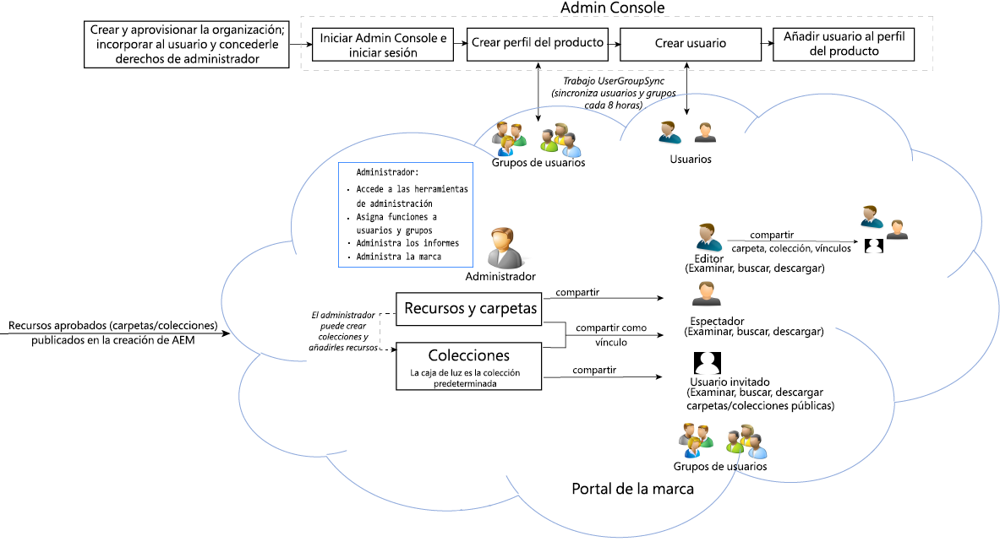

# Guía de Adobe Experience Manager Assets Brand Portal {#aem-brand-portal}

**Adobe Experience Manager Assets Brand Portal** ayuda a las organizaciones a satisfacer sus necesidades de marketing mediante la distribución segura de recursos de productos y marcas aprobados a agencias externas, socios, equipos internos y distribuidores para su descarga.

Si no hay una solución segura para compartir recursos puede conllevar lo siguiente:

* Uso compartido de recursos manual mediante el correo electrónico o la nube
* Problemas de cumplimiento normativo de la marca
* Falta de control sobre el uso de los recursos
* Retrasos en campañas y presentaciones de productos
* Contenido duplicado en ubicaciones geográficas y organizaciones
* Almacenamiento sin protección de los recursos antes de su lanzamiento

Brand Portal garantiza que la marca cumple la normativa al permitir que los especialistas en marketing colaboren con los partners del canal y los usuarios internos para crear, administrar y distribuir las instrucciones de diseño, los logotipos y los recursos de productos de campañas a los interesados.

Brand Portal es una oferta de SAAS basada en la nube. Está disponible como complemento del producto Adobe Experience Manager Assets (versión local o servicio administrado). Puede utilizar Brand Portal con [!DNL Adobe Experience Manager Assets] como [!DNL Cloud Service]. Una vez [configurado](https://experienceleague.adobe.com/es/docs/experience-manager-cloud-service/content/assets/brand-portal/configure-aem-assets-with-brand-portal), puede publicar los recursos aprobados de [!DNL Adobe Experience Manager Assets] como una instancia de [!DNL Cloud Service] en [!DNL Brand Portal] y distribuirlos a los usuarios de Brand Portal.

En la siguiente imagen, aparece la solución del flujo de trabajo de Brand Portal.

## Guía del usuario de Adobe Experience Manager Brand Portal

En esta guía se muestran los detalles de las ofertas y los flujos de trabajo claves de Brand Portal. Utilice el raíl izquierdo para ver varias funcionalidades y explorar en profundidad la variedad de personas que interactúan con el portal.

### Consulte también

| Guía del usuario | Descripción |
|--- |---|
| [Novedades](whats-new.md) | Cambios realizados en Brand Portal. |
| [Notas de la versión](brand-portal-release-notes.md) | En la versión actual encontrará mejoras y soluciones a problemas graves y conocidos. |
| [Configurar Experience Manager Assets con Brand Portal](../using/configure-aem-assets-with-brand-portal.md) | Cómo duplicar Brand Portal con Experience Manager Assets para publicar recursos. |
| [Solucionar problemas en una publicación paralela](troubleshoot-parallel-publishing.md) | Solucionar la replicación entre Brand Portal y Experience Manager Assets. |
| [Formatos de archivo admitidos](brand-portal-supported-formats.md) | Formatos de archivo admitidos en Brand Portal para su previsualización y descarga. |
| [Publicar recursos en Brand Portal](brand-portal-sharing-folders.md) | Cómo publicar carpetas, colecciones, vínculos, ajustes preestablecidos, esquemas, facetas y etiquetas en Brand Portal. |
| [Abastecimiento de recursos en Brand Portal](brand-portal-asset-sourcing.md) | Cómo configurar el abastecimiento de recursos en AEM Assets, cargar recursos en Brand Portal y volver a publicar la carpeta de contribuciones en AEM Assets. |
| [Vídeos de características de Brand Portal](https://experienceleague.adobe.com/es?lang=es&tag=Brand+Portal#recommended/solutions/experience-manager) | Aprenda a utilizar Experience Manager Assets Brand Portal con la ayuda de tutoriales de vídeo. |

### Recursos útiles

* [Explicación de Brand Portal con AEM Assets](https://experienceleague.adobe.com/es/docs/experience-manager-brand-portal/using/home)
